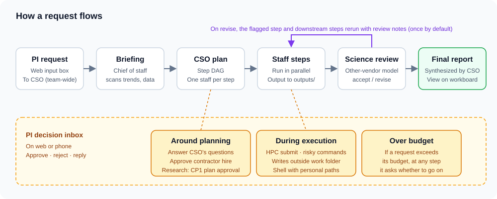
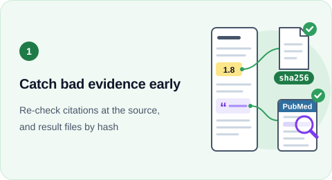
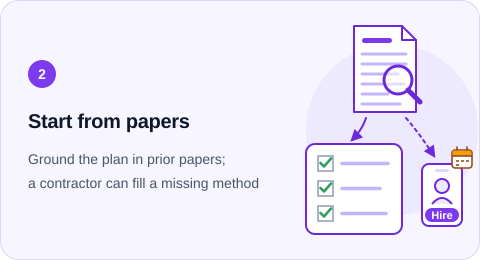
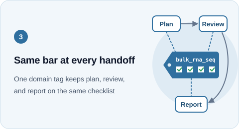
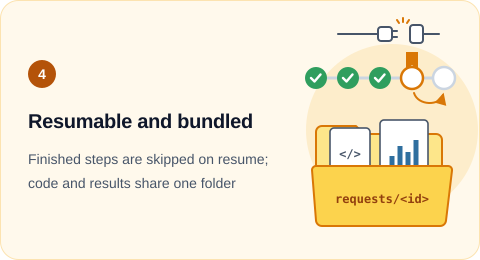

# labhq — HQ for a one-person bioinformatics lab (v0.25)

<!-- badges:start -->
[](https://code.claude.com/docs/en/overview)
[](https://github.com/openai/codex)
[](docs/manual.md#설정-포인트)
[](docs/manual.md#설정-포인트)
[](docs/manual.md#설정-포인트)
[](docs/manual.md#연결된-도구)
[](https://www.ebi.ac.uk/chembl/)
[](https://clinicaltrials.gov/)
[](https://platform.opentargets.org/)
[](https://pubmed.ncbi.nlm.nih.gov/)
[](https://www.biorxiv.org/)
[](https://github.com/ehojune/bioinfo-agent)
[](https://github.com/jmiao24/Paper2Agent)

[](https://github.com/ehojune/bioinfo-team-3d/actions/workflows/test.yml)
[](https://www.python.org/)
[](LICENSE)
[](LICENSE-CC-BY-SA-4.0.txt)
[](patch_notes/README.md)
<!-- badges:end -->

<p align="center"><a href="README.md">한국어</a> · <b>English</b></p>

Detailed docs (manual, PI Q&A) and the web UI are in Korean.

labhq is a bioinformatics **multi-agent orchestration platform** that runs Claude Code and Codex like **lab staff**.
Write a request in the web office and the CSO makes a plan, staff split the work and run it, a model from another company reviews it, and a report comes out.
Risky or costly actions are approved by the PI on the web or a phone.

| 2.5D office (`/`) | 3D office (`/3d`) |
|---|---|
|  |  |

A 15-second recording of the mock demo (`labhq demo --web`). One request goes through the CSO plan, approval, and step progress to the end.
Still frames: [2.5D](docs/media/office-25d.png) · [3D](docs/media/office-3d.png)

## How it works



- 11 staff, each role with its own engine, model, and tools. The science reviewer is deliberately a model from another company.
- Routine, well-defined analyses go to the [bioinfo-agent](https://github.com/ehojune/bioinfo-agent) staff member. It is a Claude Code agent built by this project's PI: given an analysis in plain words, it picks a matching nf-core Nextflow pipeline, writes a plan with estimated time and disk, and after approval runs it and returns a MultiQC QC verdict.
- If the team lacks a method, a paper or its code is turned into an agent with [Paper2Agent](https://github.com/jmiao24/Paper2Agent) and hired as a **contractor**.
- When a job is submitted to HPC (SGE, PBS, Slurm), the staff session rests until the job ends, then resumes the same session.
- The CSO asks only about permissions, cost, data access, choices only the PI knows (disease, cohort), and analysis depth. It decides the rest of the design itself and records it as **assumptions** in the plan and report.
- Each step leaves a record in its work folder: instructions, outputs, engine, and cost.

## Four things labhq works hard on

labhq chose to layer its checks and keep evidence that can be re-verified, over finishing fast.

<table>
<tr>
<td width="50%" valign="top">



**Catch bad evidence early**

Two layers of checks catch AI mistakes, such as inventing or misreading a citation (hallucination), before the report. The science reviewer (GPT-6-Astra) opens the PubMed source and checks each citation against it, and a request cannot pass while a finding that would change the conclusion (P1) remains. Using the claim ledger and output sha256 records (MIT) taken from [The Virtual Biotech](https://github.com/harrisongzhang/TheVirtualBiotech) (Science 2026), `labhq verify` re-checks the report's evidence anchors and hashes.

<details><summary>Evidence and limits</summary>

<sub>Evidence: [11th trial run](https://github.com/ehojune/bioinfo-team-3d/issues/298#issuecomment-5969847101) (GSE19804): the reviewer checked against the PubMed source and caught that the literature step had reversed the direction of SEMA5A in the original paper and missed the Yang 2018 hub list, so the request stopped before it produced a report · [Example GSE10072](docs/examples/gse10072/README.md): `labhq verify` re-checked the hashes of 58 outputs · [#339](https://github.com/ehojune/bioinfo-team-3d/pull/339) (verify)</sub>

<sub>Limits: Evidence anchors and PI evidence approval (CP2) run only in the research lane, which is off by default. `verify` only checks that files are unchanged; it does not prove the content is correct. The share of errors the review misses has not been measured.</sub>

</details>

</td>
<td width="50%" valign="top">



**Start from papers**

Before planning, the prior-research staff pull the analyses that must be done from a few papers and reviews on the same topic and put them in the checklist, and the report gets a "prior-research baseline" section with citations. If the team lacks a method, after PI approval you can bring in a term-limited **contractor** who holds that paper's code as a tool, using [Paper2Agent](https://github.com/jmiao24/Paper2Agent).

<details><summary>Evidence and limits</summary>

<sub>Evidence: [#395](https://github.com/ehojune/bioinfo-team-3d/pull/395) (prior-research step) · [Manual: prior-research baseline](docs/manual.md#topic-%EC%A0%90%EA%B2%80%ED%91%9C%EC%99%80-%EC%84%A0%ED%96%89-%EC%97%B0%EA%B5%AC-%EA%B8%B0%EC%A4%80) · [Manual: contractor system](docs/manual.md#%ED%8C%8C%EA%B2%AC%EC%A7%81-%EC%A0%9C%EB%8F%84-paper2agent)</sub>

<sub>Limits: The prior-research step has run on only 4 test requests. The contractor flow has passed only mock tests and has never gone as far as hiring from a real paper, and the Paper2Agent skill must be installed separately.</sub>

</details>

</td>
</tr>
<tr>
<td width="50%" valign="top">



**Same bar at every handoff**

The CSO writes a domain tag (topic key) on every plan. The key is picked from the 43 topics of a PI-reviewed vocabulary (123 keys, 79 of them linked to the [EDAM](https://github.com/edamontology/edamontology) ontology). The topics were widened from a survey of 63 papers, 4 textbooks and 66 web sources ([#420](https://github.com/ehojune/bioinfo-team-3d/issues/420)). Code uses that key to choose a checklist and passes the same list to planning, review, and single-staff runs, and items answered by assumption are left in the report's "Limitations". The research lane's (off by default) domain rule packs attach by the same key.

<details><summary>Evidence and limits</summary>

<sub>Evidence: [#390](https://github.com/ehojune/bioinfo-team-3d/pull/390) (topic required, 100-key vocabulary) · [#369](https://github.com/ehojune/bioinfo-team-3d/issues/369) (a bypass where one line in the plan text dropped the domain rules, closed with a topic check)</sub>

<sub>Limits: The checklist covers 43 domains and 124 items ([#402](https://github.com/ehojune/bioinfo-team-3d/pull/402), [#420](https://github.com/ehojune/bioinfo-team-3d/issues/420)). The 40 domains beyond the first three have not run on real requests. Whether omissions decreased has not been measured. The semantic model, which uses relations between tags, is a [shadow stage](#annotation-semantics-ontology) that is off by default, and no result shows it beats a plain SQL baseline.</sub>

</details>

</td>
<td width="50%" valign="top">



**Resumable and bundled**

Requests, steps, and approvals are stored in SQLite. If the PC stops, one PI resume card skips the finished steps and continues from the step that stopped; on a subscription limit or login expiry, the request is held and goes again once that clears. When a request ends, hash-verified outputs and the analysis code are gathered in one folder ([request bundle](docs/manual.md#%EC%9A%94%EC%B2%AD-%EB%AC%B6%EC%9D%8C)), and paths between steps are rewritten as relative paths.

<details><summary>Evidence and limits</summary>

<sub>Evidence: [v0.25 rehearsal](docs/status/2026-10-04-0458-release-v025.md) request 2: after the PC stopped and labhq was fully shut down, one resume card brought it back and it went on to a review pass (accept) · [Bench A, round 2](https://github.com/ehojune/bioinfo-team-3d/issues/373#issuecomment-5975156477): labhq reproducibility 2 → 4 points ([#384](https://github.com/ehojune/bioinfo-team-3d/pull/384)), while Astra alone got 4 and 3 points from two scorings of the same report · [#389](https://github.com/ehojune/bioinfo-team-3d/pull/389) (request bundle)</sub>

<sub>Limits: Waiting on limits and login was fixed after a real login expiry on 10-05 failed 4 requests, and was confirmed only by tests. Re-login is done by a person. The request bundle gathers only outputs from the same PC runner, and reproducibility was not re-scored after it was added.</sub>

</details>

</td>
</tr>
</table>

## Compared with standalone AI sessions and research workbenches

| | labhq | Claude Code / Codex alone | Research workbench |
|---|---|---|---|
| Review | ✅ Other-vendor reviewer\* | ❌ Same model checks itself | ⚠️ Separate-context check when on |
| Standard | ✅ Prior papers, domain checklists | ⚠️ Model's discretion | ⚠️ Depends on chosen skill |
| Evidence trail | ✅ Output hash, anchor re-check | ⚠️ Scripts and logs left behind | ✅ Output provenance, rerun compare |
| Approval | ✅ Web / phone cards | ⚠️ Inside the session | ✅ Approval modes, phone remote |
| After a stop | ✅ From the stopped step | ⚠️ Session resume only | ✅ Remote job recovery |
| Literature | ⚠️ Search and citation only | ⚠️ Depends on attached tools | ✅ Library, PDF, screening |
| Speed / cost | ❌ Big task 144 min, $31 | ✅ Same task 19 min | — |

The research workbench column was filled in from the [open-science](https://github.com/aipoch/open-science) v0.35.0 README and ROADMAP; the app was not run (2026-10, [#316](https://github.com/ehojune/bioinfo-team-3d/issues/316)). Speed and cost were not measured, so they are marked —. Whether labhq's checklists reduce omissions has not been measured yet.
\* Based on the outputs of the 8 Claude staff. Outputs of the 3 Codex staff, including the literature staff, are reviewed by a reviewer from the same company (OpenAI).
The standalone column's speed and evidence-trail values were measured on the bench baseline (GPT-6-Astra alone). Scoring was done once per task by GPT-6.1-Sol with sources hidden ([#373](https://github.com/ehojune/bioinfo-team-3d/issues/373)).

**When labhq fits**: when you must hand results to someone else together with their evidence, or want to leave a multi-hour analysis running and make only the decisions from your phone. In the v0.25 rehearsal, the 4 accepted requests had 0 to 1 PI cards per request, not counting install, budget, and resume cards ([rehearsal](docs/status/2026-10-04-0458-release-v025.md)).

**Where it still loses**: scored blind on the same tasks, the standalone session led on total score (21 to 26 on the big task, and on all three small tasks). On the big task, labhq spends over 7 times the time on other-vendor review, PI control, and the evidence ledger ([#373](https://github.com/ehojune/bioinfo-team-3d/issues/373)). For small requests, you can turn on a mode (from [#388](https://github.com/ehojune/bioinfo-team-3d/pull/388)) where one strong model finishes them directly, but it skips review by default and its effect has not been measured. If your work centers on a literature library and PDF management, a workbench fits better.

## Example: analyzing public lung adenocarcinoma data

> Download the public GEO lung adenocarcinoma dataset GSE10072 and analyze tumor vs normal differential expression, GSEA, STRING hubs, and clustering. If there are same-patient pairs, reflect that structure.

- 1 hour 17 minutes, 12 steps. The PI answered three cards (install check, plan approval, evidence approval).
- A model accounting for 33 pairs found 554 DE genes, and cell proliferation pathways were higher in tumors. Marker genes from the original paper were also reproduced.
- Every number in the report carries an evidence mark, and the report passed a science review by another company's model.

[See the original request, cards, figures, and report](docs/examples/gse10072/README.md)

## Annotation, semantics, ontology


Records get meaning in three layers. The lower the layer, the firmer; the higher, the lighter we keep it.

| Layer | What it is | In labhq |
|---|---|---|
| Annotation | Tags attached to data and evidence | A 123-term vocabulary (PI-reviewed; 79 keys linked to terms of [EDAM](https://github.com/edamontology/edamontology), a shared bioinformatics dictionary), kind and source level of evidence, output file sha256 |
| Semantics | Agreements on what to judge with the tags | Hash freeze of the PI-approved plan (CP1), rule packs per analysis type (single-cell DE, bulk tumor-vs-normal; applied by the request's topic key), a match / mismatch / unknown verdict on whether a step's input fits the method, report evidence anchors |
| Ontology | Relations between tags | Only a few parent-child relations. The map that groups a finished request into a provenance model ("who made it, and can it be reused") and an object view ("who owns what, and what awaits approval") is computed only as a shadow |

The shadow computation is off by default and only records even when on. `semantics: ab` gives reuse candidates to only half of research requests as a reference in the CSO plan, so the effect can be compared. The vocabulary is being widened to cover bioinformatics requests in general (#375). Details are in the [manual](docs/manual.md#%EC%9D%98%EB%AF%B8-%EB%AA%A8%EB%8D%B8%EA%B3%BC-%EC%98%A8%ED%86%A8%EB%A1%9C%EC%A7%80).

## Getting started on the web

### 1. Look around first (no API key or cluster)

```bash
git clone https://github.com/ehojune/bioinfo-team-3d.git
cd bioinfo-team-3d
pip install -e ".[dev]"
labhq demo --web
```

Open the printed `http://127.0.0.1:8787/?token=…` and the office with the mock team at work appears. To view it on a phone, put the PC and phone on the same Wi-Fi, run `labhq demo --web --phone`, and open the printed `/3d` URL.

### 2. Install and configure

You need: Python 3.10 or later, Git, and the CLIs you will use as staff (Claude Code, Codex), installed and logged in. CLIs installed with npm also need Node.js.

```bash
labhq init                                   # create the config file and gateway token, then check
export LABHQ_CONFIG=$PWD/config/labhq.yaml   # PowerShell: $env:LABHQ_CONFIG = "$PWD\config\labhq.yaml"
labhq doctor                                 # check config, engines, staff, and compute tools
```

`labhq init` asks for the HPC and bioinfo-agent paths. If you need a login folder dedicated to staff, it also tells you the login commands a person has to type.

### 3. Start it

Run these in two terminals. The `export` in step 2 applies only to that terminal, so set `LABHQ_CONFIG` again in the new terminal (or put it in front of the command, as in `labhq --config config/labhq.yaml runner`). If you forget, that side comes up with the default token and the gateway and runner cannot connect to each other.

```bash
labhq gateway   # stores requests, approvals, and events, and opens the web office
labhq runner    # actually runs the staff CLIs. Uses only an outbound connection to the gateway
```

In a third terminal, run `labhq open` to open the web office already logged in (the token is not printed to the screen). To open it yourself, go to `http://127.0.0.1:8787/?token=<client_token>`. `client_token` is the `gateway.client_token` value in the config file, and once opened it is saved on that device.

### 4. First request

1. Type a request in the input box below. A small public-data request is a good start (e.g. "public penguin data QC summary").
2. If the CSO asks a clarifying question, choose an option and press **답하고 진행** (Reply and continue).
3. Things to approve arrive as cards in the **결정** (Decisions) tab on the right. Approve or reject to carry on.
4. Watch step progress and outputs on the **작업판** (Workboard), and open the **최종 보고서** (Final report) when it ends. To ask more about the report, use **이어 묻기** (Follow up).
5. If you pick a running request that the CSO is handling, the input box default is **이 요청에 메모** (Note on this request). A note is delivered from the next plan or step on, not to a turn that is already running. For a request given directly to one staff member, use **이어 묻기** after it ends.

To give work directly to one staff member, pick that staff member in the input box or drag a yellow note onto their desk.
Attach GitHub URLs, DOIs, and data paths with the **참고** (Reference) button.
Phone setup is in the manual's [Launch and connect](docs/manual.md#%EB%9D%84%EC%9A%B0%EA%B8%B0%EC%99%80-%EC%A0%91%EC%86%8D) (Tailscale) and [Web office](docs/manual.md#%EC%9B%B9-%EC%82%AC%EB%AC%B4%EC%8B%A4) (add to home screen).

## Using it safely

- The PI decides on HPC submission, risky shell commands, writes outside the work folder, budget overruns, and contractor hiring.
- Original controlled-access (DUA) data is never opened with file tools; it is handled only inside HPC jobs.
- Staff run under the PI's account, but personal paths such as `~/.ssh` and browser profiles are hidden. This block applies to Claude staff; Codex staff (3 of the default 11) only receive guidance. The path guard is not a sandbox, so it cannot stop a staff member that is determined.

Details are in [Safety measures](docs/manual.md#%EC%95%88%EC%A0%84-%EC%9E%A5%EC%B9%98).

## Roadmap

| Version | Goal |
|---|---|
| v0.25 | The PI trials labhq on public data — **declared 2026-10-04** |
| v0.5 | The PI does research locally on their own public data |
| v0.75 | The PI does research on public data on HPC |
| v0.9 | The PI does research on controlled data (on HPC) |
| v0.95 | Another researcher installs from the docs alone and finishes one case on public data |
| v1 | Another researcher solves up to two research problems on their own controlled data |
| v1.25 | Goes beyond research to write papers |

Each version has pass criteria, and meeting them moves it on to the next version. The criteria, current status, and remaining work are in the [manual's roadmap](docs/manual.md#%EB%A1%9C%EB%93%9C%EB%A7%B5).

## Further reading

| Document | Who it is for |
|---|---|
| [Manual](docs/manual.md) | Readers who want depth: command line, config, safety measures, the research lane, known limits |
| [PI Q&A](docs/pi-qa.md) | What the PI asked, the answers, and the decisions made |
| [Research protocol](docs/research_protocol.md) | The research lane's contract and checkpoints |
| [Patch notes](patch_notes/README.md) | What changed |
| [AGENTS.md](AGENTS.md) · [HANDOFF.md](HANDOFF.md) | Agents developing this repository |

The code is [GPL-3.0-or-later](LICENSE); docs, figures, and data tables are [CC BY-SA 4.0](LICENSE-CC-BY-SA-4.0.txt). Exceptions are in the [manual's license section](docs/manual.md#%EB%9D%BC%EC%9D%B4%EC%84%A0%EC%8A%A4).
