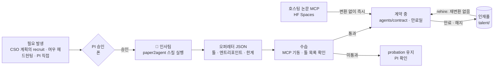
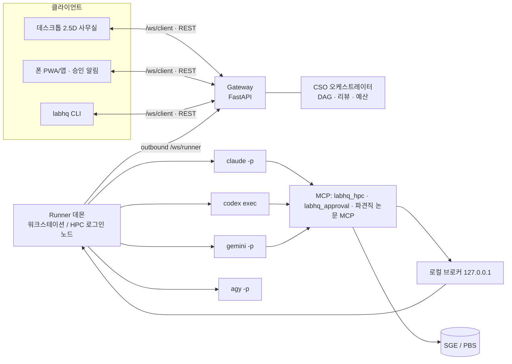

# labhq — 혼자 운영하는 바이오인포 연구소 HQ (v0.2)

[](https://github.com/ehojune/bioinfo-team-3d/actions/workflows/test.yml)
저장소: https://github.com/ehojune/bioinfo-team-3d

CLI 코딩 에이전트(Claude Code · Codex · Gemini CLI)를 **연구소 직원**처럼 굴리는 플랫폼의 1단계 골격입니다.
CSO가 계획하고, 정규직이 실행하고, 그때그때 필요한 논문은 **Paper2Agent로 파견직**이 되어 팀에 합류합니다.
모든 작업은 폰 승인 · 예산 캡 · 실험노트(출처 기록) 아래에서 돌아갑니다.

- **들어있는 것**: 실시간 웹 사무실(2.5D, 폰 대응), 러너 데몬, CLI 어댑터 4종(Claude Code · Codex · Gemini ·
  직접 만든 에이전트용 범용 CLI), SGE/PBS HPC 도구(MCP), 승인 게이트, 게이트웨이, CSO 오케스트레이터,
  **프로젝트별 GitHub 업데이트**, 파견직 채용·계약·인재풀, mock 엔진, 테스트 26개
- **아직 없는 것**: iOS 앱 (지금은 웹을 홈 화면에 추가해서 앱처럼 씀 — §6), 거버넌스(정부) 층 (§11)

---

## 0. 5분 체험 (API 키·클러스터 없이)

```bash
pip install -e ".[dev]"
labhq demo --web   # mock 팀이 계속 일하는 사무실을 브라우저로: 출력되는 http://127.0.0.1:8787/?token=… 열기
labhq demo         # 같은 흐름을 터미널 로그로
pytest -q          # 26 passed
```
게이트웨이 없이 UI만 보려면 `labhq/web/index.html`을 브라우저로 열면 됩니다 (자동으로 데모 모드).

## 0-1. 실제 실행

전제: 러너 머신에 `claude`, `codex`, `gemini`가 설치·로그인되어 있고 Python ≥ 3.10.

```bash
cp config/labhq.example.yaml config/labhq.yaml      # 토큰, HPC, 데이터 구역, 예산 수정
export LABHQ_CONFIG=$PWD/config/labhq.yaml

labhq gateway                # 작은 VM 또는 집 PC(+Tailscale). 데이터 없이 이벤트만 중계
labhq runner                 # 워크스테이션 또는 HPC 로그인 노드. 게이트웨이로 outbound 접속
labhq setup-paper2agent      # 파견직 채용용 paper2agent 스킬 설치 (1회)

# 브라우저: http://<gateway>:8787/?token=<client_token>  (토큰은 한 번만, 이후 기기에 저장)
labhq send "공개 폐선암 scRNA-seq에서 CD276 고발현 세포유형을 찾고 QC까지"   # CSO 오케스트레이션
labhq send --project my-project "새 WGS 배치 표준 QC"                     # 결과를 그 프로젝트 GitHub에도 보고
labhq send --agent analyst "outputs/의 DE 결과로 volcano plot"             # 한 직원에게 직접
labhq watch                  # 실시간 이벤트
labhq approvals              # 대기 중 승인 → labhq approve <id> [--deny --note "..."]
labhq recruit --repo https://github.com/scverse/scanpy --focus "Preprocessing and clustering" --ttl 14
labhq talent                 # 인재풀
labhq contract extend c_scanpy --days 14    # extend | release | activate | rehire
```

---

## 1. The Virtual Biotech는 어떤 에이전트를 넣었나

Stanford Zou 연구실의 Virtual Biotech(bioRxiv 2026, 저자 중 Jiacheng Miao는 Paper2Agent 제1저자)는
실제 바이오텍 조직을 그대로 본뜬 **4개 사업부 · 11개 에이전트 · 100개 이상의 도구** 구조입니다.

**지휘부**
- **가상 CSO** — 직접 분석하지 않음. 무엇을 물을지, 누구에게 물을지, 여러 층위의 증거를 어떻게 통합할지를 앎.
  비싼 분석 전에 사용자에게 의도를 되물음.
- **비서실장(chief of staff)** — CSO가 사용자와 대화하는 동안 병렬로 분야 동향·데이터 현황·최근 발표를 웹 검색으로 브리핑.
- **과학 리뷰어** — ①질문에 답했는가 ②근거가 충분한가 ③철저한가, 세 기준으로 평가 → CSO가 해당 과학자에게 재위임.

**사업부**: 타깃 발굴·우선순위 / 타깃 안전성 / 모달리티 선정 / 임상 담당(Clinical Officers)

**본문에 등장하는 과학자 에이전트**: 통계유전학, 단일세포(아틀라스), 기능유전체학, 바이오 경로(pathway),
타깃 생물학자, 약리학자, 임상시험 전문가

**운영 방식에서 배울 점**
- 에이전트마다 전공에 맞는 MCP 도구 **부분집합만** 부여 (책임 분리)
- 대량 병렬: 임상시험 전문가 에이전트 3만 7천여 개를 띄워 5만 6천 건 임상시험 결과를 **출처를 기록하며** 추출
- UI에서 추론 과정·사용 중 도구·데이터/코드/보고서 다운로드 제공 (감사 가능성)
- 사례당 비용 약 $46–54, 하루 미만

### 우리 연구소로 옮기며 바꾼 점

| Virtual Biotech | labhq | 이유 |
|---|---|---|
| 신약개발 4개 사업부 | 1인 PI 바이오인포 랩 직무 (생물학·데이터·문헌·분석·코딩·QC) | 도메인이 다름 |
| 미리 만든 자체 MCP 100여 개 | 정규직은 CLI 기본 도구 + `labhq_hpc`, 부족한 방법은 **파견직(논문 MCP)으로 수시 보강** | 도구를 미리 다 만들 수 없음 |
| 단일 벤더 | 직원별 벤더·모델 선택, **리뷰어는 다른 벤더** | 같은 모델의 맹점 공유 방지 |
| 클라우드에서 API 호출 | 로컬 러너가 HPC(SGE/PBS)에 제출 → 수면 → 기상 | 대용량·통제접근 데이터는 클러스터 밖으로 안 나감 |
| — | 폰 승인 게이트, 예산 캡, 데이터 구역, 실험노트 | 한 사람이 감독 가능한 형태 |

---

## 2. 조직도

| 캐릭터 | id | 직무 | 기본 엔진/모델 | 도구 |
|---|---|---|---|---|
| 🦉 부엉이 CSO | `cso` | 질문 설계·업무 배분·증거 통합 (분석 안 함) | Claude Code / opus | Read·Glob·Grep만 |
| 🐧 펭귄 비서실장 | `chief_of_staff` | 착수 브리핑: 동향·데이터 접근성·리스크 | Claude Code / sonnet | 웹 |
| 🐻 곰 Biology 만물박사 | `biologist` | 가설·메커니즘·교란요인 | Claude Code / opus | 웹 |
| 🦦 수달 bioinfo-agent | `bioinfo-agent` | 반복·정형 분석 전담 (검증된 파이프라인을 표준대로 반복) | 자체 에이전트 (`engine: cli`) | HPC |
| 🐿️ 다람쥐 데이터 담당 | `data_steward` | 공개/통제접근 데이터 확보, 매니페스트·체크섬 | Claude Code / sonnet | HPC |
| 🦊 여우 문헌·헤드헌터 | `lit_scout` | 문헌 검색 + 파견직 후보(논문+코드) 발굴 | Antigravity / gemini-3.8-flash-high | Google 검색 |
| 🦝 너구리 분석가 | `analyst` | 분석 설계·실행 (nf-core·Snakemake 우선) | Claude Code / opus | HPC |
| 🐙 문어 엔지니어 | `engineer` | 파이프라인·도구·테스트·컨테이너 | Codex | HPC |
| 🦔 고슴도치 Data QC | `qc_reviewer` | PASS/WARN/FAIL QC 보고서 | Claude Code / sonnet | HPC |
| 🐢 거북이 과학 리뷰어 | `sci_reviewer` | 3기준 리뷰 (교차 벤더) | Codex / read-only | — |
| 🦫 비버 인사팀 | `recruiter` | Paper2Agent 변환·검증·오퍼레터 | Claude Code / opus | Skill·Agent |
| 🐥 파견직 (논문 종이모자 병아리) | `c_<slug>` | 논문의 방법 적용 | Claude Code / sonnet | 논문 MCP + 논문 스킬 |

엔진·모델·도구는 `agents/core/*.yaml`에서 직원별로 바꿉니다. (예: `engine: antigravity`, `model: gemini-3.8-flash-high`)

### bioinfo-agent 연결하기
직접 만든 에이전트는 `engine: cli`로 붙습니다. `agents/core/bioinfo-agent.yaml`의 `cli.command`를 실제 실행 방식으로
바꾸면 되고, 명령에는 `{prompt_file}`, `{workdir}`, `{outputs}`, `{mcp_config}`, `{session_id}` 같은 자리표시자를 씁니다.
stdout으로 JSON 줄을 내보내면 사무실 애니메이션까지 살아납니다 (`output: jsonl`):

```json
{"type": "status", "state": "working", "task": "batch QC"}
{"type": "tool", "name": "fastqc", "input": {"samples": 12}}
{"type": "log", "text": "12/12 samples passed"}
{"type": "result", "ok": true, "text": "…보고…", "structured": {}, "session_id": "…", "cost_usd": 0.05}
```
평범한 텍스트만 내보내도 됩니다 (`output: text`). `{mcp_config}`에는 labhq의 승인·HPC MCP 서버가 Claude 형식
`mcp.json`으로 들어 있어서, Claude Agent SDK 기반이면 그대로 불러 쓸 수 있습니다. CSO는 반복·정형 작업을
bioinfo-agent에게, 새 분석 설계는 너구리 분석가에게 나눠 맡깁니다.

---

## 3. 파견직 제도 (Paper2Agent)



### 세 가지 유형

| 유형 | 입력 | Paper2Agent 경로 | 할 수 있는 일 |
|---|---|---|---|
| 자문형 `consultant` | 논문 PDF(+보충자료) | Paper2Skill → `SKILL.md` + 본문·그림·표 | 방법·결과 질의, 우리 결과 해석 자문 |
| 기술자형 `technician` | 코드 저장소 | Paper2MCP → 튜토리얼 재현으로 검증된 MCP 툴 | 새 데이터에 그 논문의 방법 적용 |
| 풀패키지 `full` | 둘 다 | 둘 다 | 위 전부 |

### 작동 방식
1. **채용 요청** — CSO 계획의 `recruit` 필드(“팀에 이 방법 가진 사람이 없다”)가 `recruit.suggested` 이벤트로
   폰에 뜨고, PI가 승인하면 `POST /api/recruit`. 여우 헤드헌터는 논문·저장소·튜토리얼 유무·필요 API 키를 조사해 후보를 올립니다.
2. **변환** — 인사팀이 `talent/<slug>/build`에서 paper2agent 스킬을 실행. `--json-schema`로 오퍼레터 형식을 강제하고
   `--max-budget-usd`로 비용 상한.
3. **수습** — labhq가 납품된 MCP 서버를 직접 띄워 툴 목록을 확인 (자문형은 스킬 존재 확인). 통과하면 `active`.
4. **계약서** — `agents/contract/c_<slug>.yaml`. 비밀값은 `${ENV}` 자리표시자만 저장. 명단에 `[파견직]` 태그와 툴 목록이
   올라가서 CSO가 다음 계획부터 바로 배정합니다.
5. **업무** — 작업공간에 논문 스킬을 설치(`.claude/skills`, `.agents/skills`)하고 논문 MCP를 연결. 계약 프롬프트는
   “검증된 범위 밖이면 즉흥적으로 하지 말고 CSO에 반환”을 규칙으로 둡니다.
6. **만료·재고용** — 만료된 계약은 로드 시 자동으로 인재풀로 이동. 빌드가 보관되어 있어 `rehire`는 즉시.

### 주의
- 변환은 **제3자 코드를 설치·실행**합니다. 가능하면 러너를 컨테이너/VM 또는 전용 계정에서 돌리세요.
  기본값은 `permission_mode: auto` + 위험 명령 폰 승인.
- paper2agent 스킬은 병렬 서브에이전트를 띄울 수 있는 호스트(Claude Code, Codex)가 필요합니다.
- 수습 통과는 “선택된 툴이 기동·응답한다”는 뜻이지 저장소 전체의 과학적 정확성 보증이 아닙니다.
  중요한 분석 전에는 QC 담당에게 논문 예제 재현을 시키는 것을 권합니다 (로드맵의 정식 수습 평가).

---

## 4. 프로젝트별 GitHub 업데이트

팀은 안에서 사내 메신저(웹 사무실의 이벤트 흐름)로 소통하고, 동시에 **각 프로젝트의 GitHub 저장소에 진행 상황을 올립니다.**
요청에 프로젝트를 지정하면(`--project`, 웹 입력창의 프로젝트 선택):

1. 요청마다 이슈 하나 — `[labhq] <요청>`
2. CSO 계획표, 과학 리뷰 결과(1차 수정 요청 → 2차 통과), 파견직 합류를 코멘트로
3. 최종 보고서를 `labhq/reports/<날짜>-<request>.md`로 커밋하고, 이슈에 요약·링크를 남긴 뒤 닫기
4. `local_dir`을 주면 에이전트들이 그 프로젝트 클론에서 작업

설정은 `config/labhq.example.yaml`의 `github:`·`projects:`. 토큰은 게이트웨이 호스트의 `GITHUB_TOKEN` 환경변수에서만 읽습니다
(fine-grained PAT, 해당 저장소의 Issues·Contents 읽기/쓰기). **공개 가드**: 통제접근 경로와 비밀값으로 보이는 문자열은 가리고,
`visibility: public` 저장소에는 `allow_public_reports: true`가 없으면 아무것도 올리지 않습니다.

**Codex와 PR에서 대화할 때 규칙**: Codex에게 하는 PR 코멘트에는, Codex 코멘트 바로 아래 답글이라도 항상 `@codex`를 붙입니다.
`labhq codex-review <project> <PR번호>`는 `@codex review` 코멘트를 남기고, 에이전트 공통 규칙에도 같은 내용이 들어 있습니다.

## 5. 요청하진 않았지만 필요한 것들

| # | 구성요소 | 왜 필요한가 | 상태 |
|---|---|---|---|
| 1 | **폰 승인 게이트** | HPC 제출(코어·시간 기준), 위험 bash, 예산 초과, 파견직 채용을 사람이 결정 | 구현 |
| 2 | **통제접근 데이터 구역** | DUA 데이터 원본이 LLM 대화에 들어가지 않게: 파일 도구 차단, 해당 경로 Bash는 승인, 원본은 HPC 작업 안에서만 처리하고 요약만 읽음 | 구현 (가드레일, §8) |
| 3 | **HPC 수면/기상** | 긴 작업 동안 LLM 세션을 켜두지 않음 → 제출 후 턴 종료, 작업 종료 감지 시 같은 세션 resume | 구현 |
| 4 | **교차 벤더 과학 리뷰** | Virtual Biotech의 3기준 리뷰 + 다른 회사 모델로 맹점 분산 | 구현 |
| 5 | **예산 캡 · 모델 티어링** | 태스크(`--max-budget-usd`)·요청 단위 상한, 초과 시 폰 승인. 판단은 opus, 반복 업무는 sonnet | 구현 |
| 6 | **실험노트 / 출처 기록** | 태스크마다 `TASK.md`, `manifest.json`(스펙 해시·엔진·모델·세션·비용), `events.jsonl`, `jobs.jsonl`, 잡 스크립트·로그 | 구현 |
| 7 | **인재풀** | 한 번 채용한 파견직을 재변환 없이 재고용 | 구현 |
| 8 | **에이전트 인사고과** | 정답을 아는 소형 과제 세트(예: 알려진 QC 불량 샘플 찾기)로 모델·프롬프트 변경마다 회귀 테스트 | 로드맵 |
| 9 | **프로젝트 메모리** | 프로젝트별 결정 로그·용어집을 CLAUDE.md/AGENTS.md로 주입해 같은 질문 반복 방지 | 로드맵 |
| 10 | **Fan-out 모드** | “같은 작업 × 수천 항목”(변이·논문·샘플 스크리닝)을 저가 모델 + JSON 스키마 + 출처 필드로 병렬 처리 | 로드맵 |
| 11 | **명확화 질문 루프** | CSO의 `clarifying_questions`를 폰으로 받고 답한 뒤 재계획 (지금은 이벤트만) | 부분 |
| 12 | **킬 스위치 · 감사** | 태스크 취소 API, 전체 이벤트 로그 | 부분 |
| 13 | **워크플로 엔진 우선** | 분석가·엔지니어는 nf-core/Snakemake, 버전·컨테이너 고정을 기본 정책으로 | 프롬프트 정책 |

---

## 6. 웹 사무실과 폰

게이트웨이 주소(`/`)가 곧 사무실입니다. 직원마다 자리가 있고, 상태가 모양으로 보입니다.

| 상태 | 사무실에서 | 색 (게놈 브라우저 염기색에서 따옴) |
|---|---|---|
| 작업 중 | 타이핑, 모니터 켜짐, 말풍선에 쓰는 도구나 방금 한 말 | 초록 (A) |
| 승인 기다림 | 손 들기, 느낌표 | 호박색 (G) |
| HPC 기다리는 중 | 눈 감고 zZ, 서버 랙 불빛 깜빡임 | 파랑 (C) |
| 문제 발생 | 흔들림, 땀방울 | 빨강 (T) |
| 완료 | 폴짝, 체크 표시 | — |

- 뒷벽 **화이트보드**: 지금 요청과 단계(브리핑 → 계획 → 실행 → 리뷰 → 보고), 스텝별 진행
- **서버 랙**: 최근 HPC 작업 8개의 불빛, **입구**: 파견직이 들어올 때 문이 열리고 걸어 들어옴
- 오른쪽(폰에서는 아래): **결정할 일**(승인·거절, 파견직 채용 제안), 요청의 작업 순서도(DAG), **사내 메신저**, HPC 작업 목록
- 아래 입력창: CSO에게(팀 전체) 또는 특정 직원에게 직접. 데스크톱에서는 노란 **메모를 책상에 끌어다 놓으면** 그 직원에게 맡김
- 직원을 누르면 상세 카드: 지금 하는 일, 엔진·모델, 최근 활동, 파견직이면 계약 연장·종료

폰에서는 Safari로 열고 **공유 → 홈 화면에 추가**하면 앱처럼 전체 화면으로 뜹니다. 게이트웨이와 폰에 Tailscale을 켜 두면
밖에서도 안전하게 접속됩니다. iOS 네이티브 앱은 같은 WebSocket 프로토콜을 쓰는 SwiftUI(또는 Expo) 앱으로 로드맵에 있습니다.

## 7. 아키텍처와 이벤트



러너가 게이트웨이로 **나가는** 연결만 쓰므로 연구실 PC나 HPC에 포트를 열 필요가 없습니다.

| 이벤트 | 의미 | UI 매핑 아이디어 |
|---|---|---|
| `agent.status` (queued · working · waiting · hibernating · done · error) | 직원 상태 | 타이핑 / 손들기 / 잠자기 zZ / 박수 / 땀 |
| `agent.tool` · `agent.log` · `agent.usage` | 도구 사용·발화·비용 | 도구 아이콘, 말풍선, 비용 게이지 |
| `task.dispatched` · `task.result` | 업무 배정·완료 | 서류가 책상 사이를 이동 |
| `approval.requested` · `approval.resolved` | 승인 요청·결과 | 폰 푸시, 책상 위 빨간 깃발 |
| `job.submitted` · `job.state` · `jobs.finished` | HPC 작업 | 서버실 랙 불빛, 기상 알람 |
| `request.plan` · `request.step_done` · `request.review` · `request.completed` | 요청 진행 | 화이트보드 DAG, 리뷰 도장 |
| `recruit.suggested` · `recruit.status` · `recruit.done` · `roster.updated` | 파견직 | 입구에 새 병아리, 명패에 만료일 |
| `request.created` · `github.posted` · `github.failed` | 요청 접수, GitHub 보고 | 메신저에 링크 |

REST (Bearer `client_token`): `GET /api/agents`, `POST /api/requests`, `GET /api/requests/{id}`,
`GET|POST /api/approvals[/{id}]`, `POST /api/tasks/{id}/cancel`, `POST /api/recruit`, `POST /api/contracts/{agent_id}`,
`GET /api/projects`, `POST /api/projects/{id}/prs/{n}/codex-review`, `GET /api/events`, `GET /api/health`. 폰은 `/ws/client`로 스냅샷+이벤트를 받고 `{"type":"approval.resolve",...}`로 바로 승인할 수 있습니다.

---

## 8. 설정 포인트

- **HPC** (`hpc:`): `scheduler: sge | pbs`. SGE는 PE 이름(`smp`/`threads`…), 메모리 리소스(`h_vmem`는 보통 슬롯당이라
  총 메모리를 코어 수로 나눔), `h_rt`. PBS는 Torque(`nodes=1:ppn=…`)와 PBS Pro(`select=1:ncpus=…`, `pro: true`)를 템플릿으로.
  로그인 노드에서만 qsub이 된다면 `ssh_host` 지정 — 이때 작업공간은 공유 파일시스템에 있어야 합니다.
- **데이터 구역** (`policy.data_zones`): 통제 원본은 절대경로로 지정. 권장: Linux 러너 전용 계정, 데이터 계정 소유·권한 `0700`인 구역, `hpc.submit_prefix: ["sudo", "-n", "-u", "data-account"]`와 `hpc.user: data-account`. `sudoers`는 `qsub`만 허용하고, 공유 폴더에는 집계 결과만 둡니다. 구역이 설정되면 Windows 러너는 시작을 거부하며, POSIX 러너 계정이 원본을 읽을 수 있어도 거부합니다. `policy.allow_runner_read_restricted: true`는 경고를 남기는 명시적 예외입니다.
- **승인·예산** (`policy.approvals`, `policy.budget`): `hpc_core_hours_threshold: 0`이면 모든 제출을 승인받음.
- **직원** (`agents/core/*.yaml`): `engine`, `model`, `tools`(사전 허용), `builtin_mcp`(`approval`, `hpc`),
  `permission_mode`, `project_dirs`.
- **엔진 실행 파일** (`engines`): `claude_code`, `codex`, `gemini`, `antigravity`의 `bin`과 `extra_args`.
  Antigravity는 MCP가 없고 `permission_mode: default`는 `--sandbox`, `auto`는 `--sandbox --dangerously-skip-permissions`입니다.

## 9. 폰 연결

게이트웨이는 데이터 없이 이벤트만 중계하므로 가장 작은 VM이나 집 PC로 충분하고, 안 쓸 땐 꺼도 됩니다
(러너는 재접속 루프로 대기). 가장 간단한 구성은 게이트웨이 머신과 폰에 Tailscale을 켜고 tailnet 주소로 접속하는 것.
공개 인터넷에 열어야 한다면 TLS 프록시(Caddy 등) 뒤에 두고 토큰을 반드시 교체하세요.

## 10. 알려진 한계 · 첫 실행 때 확인할 것

- Windows 11 실측 스트림은 `tests/fixtures/real/`에 있습니다. 재캡처: `python scripts/probe_engines.py antigravity --output-dir <저장소 밖 경로> --redact`.
- Codex 0.155.0-alpha.16의 `exec` 기본 승인 정책 `never`는 MCP 호출을 실패시켰습니다 (#24135). labhq 내장 MCP에만 `default_tools_approval_mode="approve"`를 설정하고 도구 안에서 폰 승인을 받습니다.
- Gemini CLI 0.57.0 개인 계정은 `IneligibleTierError`와 빈 stdout, 종료 코드 0을 냈습니다. 이 계정은 Antigravity를 쓰며 Gemini 어댑터는 Workspace 계정용으로 남깁니다.
- Antigravity 1.2.11은 호출 단위 승인 훅이 없습니다. 헤드리스 도구 거부는 `denied_actions`에만 남을 수 있습니다. 통제 데이터 접근 직원에게 지정하지 마세요.
- Claude Code 2.1.282는 로그아웃 상태에서 `is_error: true`와 `subtype: success`를 함께 냅니다.
- `--permission-prompt-tool` 응답은 텍스트 블록 하나여야 합니다. mcp 2.x가 붙이는 구조화 결과가 있으면 Claude가 거부해서, 승인 도구는 구조화 출력을 끕니다.
- Claude는 권한 규칙을 POSIX로 정규화한 경로와 대조합니다. Windows에서는 `Read(//c/Users/...)`만 막히므로 labhq가 드라이브 경로를 그 형태로 바꿉니다.
- 헤드리스 Claude는 사용자 hook·개인 서브에이전트를, Codex는 사용자 config.toml·전역 AGENTS.md를 불러왔습니다. 안전·복구 최소선 단계에서 전용 계정/격리로 해결합니다.
- 승인 대기가 길면 Claude의 MCP 툴 타임아웃에 걸릴 수 있어 러너가 `MCP_TOOL_TIMEOUT`을 늘려 줍니다.
- **경로 기반 가드는 셸 우회까지 막는 샌드박스가 아닙니다.** 원본은 계정·파일 권한으로 격리하세요.

## 11. 로드맵

1. **iOS 앱**: 같은 WebSocket 프로토콜의 SwiftUI(또는 Expo) 앱 + 승인 푸시 알림(APNs). 그 전까지는 홈 화면 웹앱
2. **거버넌스(정부) 층**: 연구소들 위에서 규칙·감사·예산을 맡는 기관 — 구성은 확인 후 설계 (자리만 비워 둠)
3. **Fan-out 모드 · 명확화 루프 · 프로젝트 메모리**
4. **인사고과(평가 세트) · 비용 대시보드 · 정식 수습 평가**(논문 예제 재현)
5. 사무실에서 직원 모델 바꾸기(드래그 앤 드롭), Tauri 데스크톱 패키징

## 12. GitHub에 올리기

```bash
./scripts/publish_github.sh          # gh CLI로 public 저장소 <내 계정>/labhq 생성 + push
./scripts/check_public.sh            # 올리기 전 점검: 비밀값, 실제 설정 파일, 대용량·유전체 데이터 파일
```

## 13. 파일 구조

```
labhq/
  settings.py  models.py  policy.py  registry.py  util.py  cli.py
  web/          index.html (사무실 UI, 의존성 없음) · manifest · icon
  integrations/ github (프로젝트 이슈·보고서 커밋·공개 가드·@codex 리뷰)
  adapters/     base · claude_code · codex · gemini · antigravity · cli (자체 에이전트) · mock
  runner/       daemon (게이트웨이 연결·실행·잡 감시) · approvals (로컬 브로커) · workspace (실험노트)
  tools/        scheduler (SGE/PBS) · hpc_mcp · approval_mcp · _mcpcompat (mcp 1.x/2.x 호환)
  gateway/      server (FastAPI · WS · REST)
  orchestrator/ cso (브리핑 → 계획 → DAG → 리뷰 → 보고)
  recruit/      paper2agent (채용 → 수습 → 계약)
agents/core/*.yaml       정규직 11명 (bioinfo-agent 포함)
agents/contract/         파견직 계약서 (+ 템플릿, 호스팅 AlphaGenome 예시)
config/labhq.example.yaml
scripts/                 publish_github.sh · check_public.sh
tests/                   스케줄러 파서 · 정책 · 레지스트리 · MCP 서버 · 어댑터(fake CLI) · 자체 에이전트 CLI ·
                         GitHub 보고(fake API) · 웹 · 전체 흐름(mock)
```
