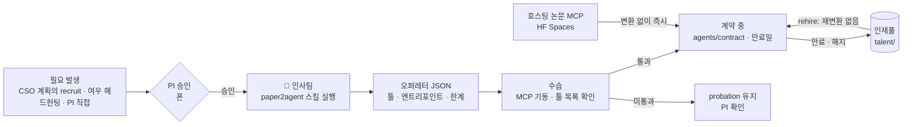
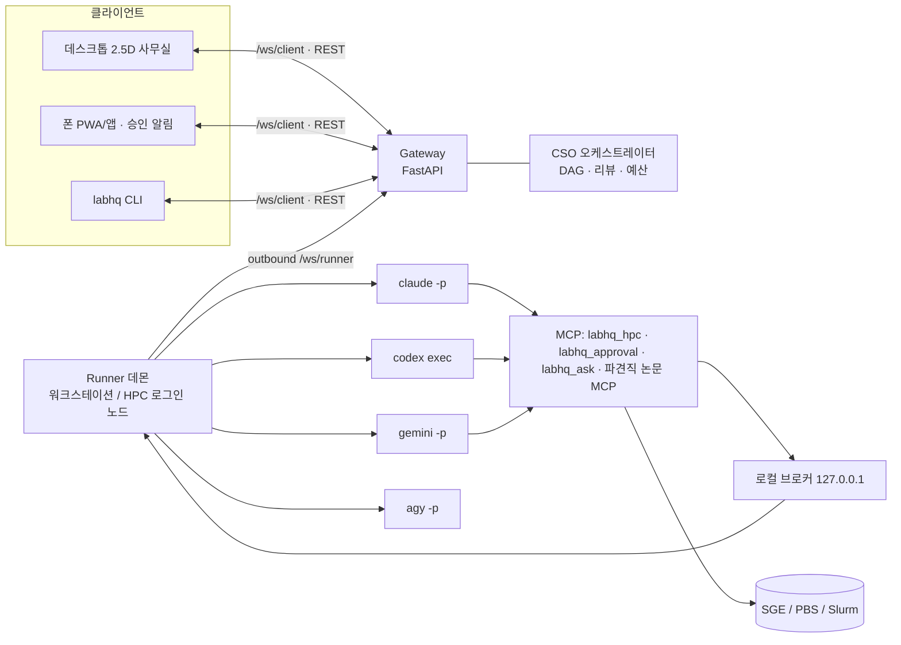

# labhq — 혼자 운영하는 바이오인포 연구소 HQ (v0.2)

<!-- badges:start -->
[](https://code.claude.com/docs/en/overview)
[](https://github.com/openai/codex)
[](#8-설정-포인트)
[](#8-설정-포인트)
[](#8-설정-포인트)
[](#연결된-도구)
[](https://www.ebi.ac.uk/chembl/)
[](https://clinicaltrials.gov/)
[](https://platform.opentargets.org/)
[](https://pubmed.ncbi.nlm.nih.gov/)
[](https://www.biorxiv.org/)
[](https://github.com/ehojune/bioinfo-agent)
[](https://github.com/jmiao24/Paper2Agent)

[](https://github.com/ehojune/bioinfo-team-3d/actions/workflows/test.yml)
[](https://www.python.org/)
[](LICENSE)
[](LICENSE-CC-BY-SA-4.0.txt)
[](patch_notes/README.md)
<!-- badges:end -->

저장소: https://github.com/ehojune/bioinfo-team-3d

Claude Code와 Codex를 **연구소 직원**처럼 운영하는 플랫폼입니다. Gemini와 직접 만든 CLI도 어댑터로 연결할 수 있습니다.
CSO가 계획하고, 정규직이 실행하고, 그때그때 필요한 논문은 **Paper2Agent로 파견직**이 되어 팀에 합류합니다.
모든 작업은 폰 승인 · 예산 캡 · 실험노트(출처 기록) 아래에서 돌아갑니다.

바뀐 내용은 [패치노트](patch_notes/README.md)에서 확인하세요. 용어는 [§0-2 핵심 개념](#0-2-핵심-개념)에 모았습니다.

| 2.5D 사무실 (`/`) | 3D 사무실 (`/3d`) |
|---|---|
|  |  |

`labhq demo --web`의 mock 시나리오를 15초 동안 녹화한 움직이는 화면입니다. 요청 하나가 CSO 계획, 승인, 단계 진행을 거쳐 끝납니다.
실제 CLI 없이 돌아갑니다. 정지 화면: [2.5D](docs/media/office-25d.png) · [3D](docs/media/office-3d.png)

- **들어있는 것**: 실시간 웹 사무실(2.5D·3D, 폰 대응), 러너 데몬, CLI 어댑터 4종(Claude Code · Codex · Gemini ·
  직접 만든 에이전트용 범용 CLI), SGE/PBS/Slurm HPC 도구(MCP), 승인 게이트, 게이트웨이, CSO 오케스트레이터,
  **프로젝트별 GitHub 업데이트**, 파견직 채용·계약·인재풀, mock 엔진, 테스트
- **아직 없는 것**: iOS 앱 (지금은 웹을 홈 화면에 추가해서 앱처럼 씀 — §6), 거버넌스(정부) 층 (§11)

---

## 0. 5분 체험 (API 키·클러스터 없이)

```bash
pip install -e ".[dev]"
labhq demo --web   # mock 팀이 계속 일하는 사무실을 브라우저로: 출력되는 http://127.0.0.1:8787/?token=… 열기
labhq demo         # 같은 흐름을 터미널 로그로
pytest -q
```
90초 MCP 실측까지 포함하려면 `LABHQ_SLOW_TESTS=1 pytest -q tests/test_long_mcp_call.py`를 실행합니다.

폰에서는 `labhq demo --web --phone`을 실행하고 출력된 `/3d` URL을 여세요.
게이트웨이 없이 UI만 보려면 `python -m http.server --directory labhq/web 8000` 뒤 `http://127.0.0.1:8000/?demo=1`을 엽니다.

## 0-1. 실제 실행

전제: Python ≥ 3.10, Git, 설정한 직원 CLI의 설치·로그인. npm 설치 CLI는 Node.js도 필요합니다.

```bash
labhq init                                        # 첫 설치 설정과 doctor 점검
export LABHQ_CONFIG=$PWD/config/labhq.yaml
```

PowerShell:

```powershell
labhq init
$env:LABHQ_CONFIG = "$PWD\config\labhq.yaml"
```

`labhq init`은 예시 설정을 복사해 gateway token을 무작위로 만들고 HPC·bioinfo-agent 경로를 묻습니다.
한 PC에서 여러 연구소를 띄우려면 `labhq init --instance <이름>`을 실행한 뒤 각 명령에 같은
`--instance <이름>`을 붙이세요. 설정·state·runs·talent·포트·token이 인스턴스별로 나뉩니다.
엔진 로그인과 사용량 한도는 모든 인스턴스가 공유합니다.
스케줄러는 `qsub`/`qstat`(SGE·PBS)과 `sbatch`/`sinfo`(Slurm)로 찾고, 종류를 하나로 정할 수 없으면 묻습니다(`--yes`면 멈춤).
스케줄러 도구가 있으면 HPC 상담을 합니다(#119). 읽기 전용 조회(SGE `qconf -sql`·`-spl`·`-sp`·`-sc`, PBS `qstat -Q`·`qstat -B -f`·`pbsnodes -a`, Slurm `sinfo`)로 큐·PE·메모리 리소스·PBS 종류를 모아 `hpc:` 초안을 설정에 넣고 보여 줍니다.
설정을 저장한 뒤 `sleep 1` 시험 잡(1코어, 5분)의 제출 명령을 보여 주고, PI가 `y`라고 답할 때만 한 번 제출해 끝날 때까지 추적합니다. `--yes`·`--dry-run`에서는 묻지 않고, 통제 구역 안에서는 제출하지 않습니다.
클러스터가 없으면 `scheduler: none`이고, 무거운 단계는 로컬 CLI로만 돌리며 그럴 수 없는 단계는 CSO가 계획에서 밝힙니다. `ssh_host`·데이터 계정 전환(`submit_prefix`)은 상담이 정하지 않습니다(§8).
`--yes`는 기본값을 수락하고 `--dry-run`은 파일 생성 없이 변경과 doctor 점검을 보여 줍니다. 기존 설정은 보존하며 `--force`일 때만 교체합니다.
Windows에서는 restricted 구역을 빼고, 개인 Codex 지침이 있으면 직원 전용 `CODEX_HOME`과 사람이 실행할 로그인 명령을 안내합니다.
Codex `bin`이 비어 있거나 `auto`이면 Windows 앱의 최신 폴더(mtime)를 탐지하며 doctor에 경로를 표시합니다. 앱이 없으면 PATH를 사용합니다.

실행 전 `labhq doctor`로 설정·엔진·직원·계산 도구를 점검하세요. `labhq doctor --json`은 러너 상태 디렉터리에 `capabilities.json`을 쓰고, `--network`를 붙일 때만 공개 데이터 사이트에 접속합니다. 이 manifest의 `runner_capabilities`는 러너가 보고하는 기능과 같은 설정·roster에서 산출한 사실입니다.
npm의 `.cmd`/`.bat` shim은 여러 줄 prompt를 손상시킬 수 있어 labhq가 표준 npm shim만 Node.js로 풀어 실행합니다.
풀 수 없는 shim은 거부합니다. Windows에서 직접 지정하려면 다음처럼 `bin`과 `prefix_args`를 사용하세요(설치된 package 경로 확인).

Codex 직원 로그인 격리는 §10의 전용 `CODEX_HOME` 안내를 따릅니다. `labhq doctor`가 구성을 점검합니다.

```bash
labhq gateway                # 작은 VM 또는 집 PC(+Tailscale). 요청·승인·이벤트를 로컬 SQLite에 저장
labhq runner                 # 워크스테이션 또는 HPC 로그인 노드. 게이트웨이로 outbound 접속
labhq setup-paper2agent      # 파견직 채용용 paper2agent 스킬 설치 (1회)

# 브라우저: http://<gateway>:8787/?token=<client_token>  (토큰은 한 번만, 이후 기기에 저장)
labhq send "공개 폐선암 scRNA-seq에서 CD276 고발현 세포유형을 찾고 QC까지"   # CSO 오케스트레이션
labhq send --project my-project "새 WGS 배치 표준 QC"                     # 결과를 그 프로젝트 GitHub에도 보고
labhq send --agent analyst "outputs/의 DE 결과로 volcano plot"             # 한 직원에게 직접
labhq send --ref scverse/scanpy --ref doi:10.1038/nature12373 "같은 방식으로 재현"  # 참고 자료 포인터(여러 번)
labhq send --plan-only "같은 roster로 분석 계획만 작성"                   # 실행·과학 리뷰 전에 종료
labhq send --plan-only --cso-model gpt-6-astra "같은 요청의 계획 비교"     # 이 요청의 CSO 모델만 변경
labhq watch                  # 실시간 이벤트
labhq approvals              # 대기 중 승인 → labhq approve <id> [--deny --note "..."], CP2는 --choice approve|revise|deny
labhq recruit --repo https://github.com/scverse/scanpy --focus "Preprocessing and clustering" --ttl 14
labhq talent                 # 인재풀
labhq contract extend c_scanpy --days 14    # extend | release | activate | rehire
```

### 비교 bench

PI 결정(2026-10-01, #40)에 따른 기본 비교군입니다. 실제 실행은 PI 머신의 구독을 씁니다.

| arm | model · effort |
|---|---|
| `labhq` | Claude 직원 `opus=sonnet` 치환, Codex 직원은 설정 그대로 |
| `sonnet-max` | `claude -p --model sonnet --effort max` (Claude CLI 최고 effort) |
| `sol-ultra` | `codex exec -m gpt-5.6-sol -c model_reasoning_effort="ultra"` |
| `astra-ultra` | `codex exec -m gpt-6-astra -c model_reasoning_effort="ultra"` |

```bash
labhq bench list
labhq bench run inco-kras-g12c --dry-run
labhq bench run inco-kras-g12c --arms labhq,sonnet-max,sol-ultra,astra-ultra --output ~/.labhq/bench
labhq bench run inco-kras-g12c --arms labhq --staff-model opus=sonnet
labhq bench run inco-kras-g12c --arms sol-ultra,astra-ultra
labhq bench report inco-kras-g12c
labhq bench rescore inco-kras-g12c --all  # 현재 검사로 재채점; --run-id ID 또는 생략 시 최신 run, 이전 판정은 score.json에 보존
labhq bench test-agent --arms labhq,sonnet-max --engines mock
```

`bench.arms`에 arm별 `engine`(`claude_code`/`codex`), `model`, `effort`를 설정합니다.
이 mapping을 지정하면 기본 baseline을 대체합니다. Opus도 별도 arm으로 추가할 수 있습니다.
`bench.staff_model` 기본값은 `{opus: sonnet}`이며 `{}`로 치환을 끕니다. `--staff-model FROM=TO`는 반복 지정합니다.
원본 직원 YAML은 보존하며 결과표에는 실행 당시 모델·effort를 기록합니다.

결과는 `case-id/<run-id>/<arm>/`에 쌓입니다. `run`과 `report`는 arm별 최신 결과를
`case-id/comparison.md`·`comparison.json`으로 합칩니다. 실행별 비교표와 `test-agent-summary.*`도 남깁니다.
real/mock은 따로 모으며 mock 보고는 `report --engines mock`으로 봅니다.
기본 폴더는 `$LABHQ_BENCH_DIR` 또는 `~/.labhq/bench`입니다.

`labhq/bench_data/cases/`의 고정 참고 자료·초기 prompt는 모든 arm이 같습니다. 자료·검사기는 wheel에도 포함됩니다. scripted PI 답변은 LabHQ 질문에만 제공합니다.
각 arm은 보고서 끝에 같은 case별 JSON 결과 블록을 씁니다. LabHQ 상태·비용 문구는 이 블록 앞에 둡니다. 점수는 그 값을 기준으로 매기며 형식 실패와 값 오답을 따로 집계합니다. 문장 검사는 근거·한계 서술을 보는 보조 항목입니다.
비대화 baseline의 질문 감지 불가·답변 미제공은 표에 표시합니다. 개인 설정은 격리하고 Codex global `AGENTS.md`가 있으면 거부합니다.
Claude baseline은 자기 arm의 파일 쓰기·단순 명령을 허용합니다. [권한 범위와 Windows 제약](docs/reference/bench-permissions.md), [실제 답 15개 보정](bench/calibration.md)을 참고하세요.
모든 arm은 case의 `timeout_s`(없으면 `runner.task_timeout_s`)를 씁니다. baseline은 timeout·취소 시 CLI 프로세스 트리를 종료합니다.
예산 초과는 기본 거절입니다. 실험에서 `run`·`test-agent --approve-budget-up-to 3`을 지정하면 labhq의 요청 총예산이 case 예산 3배 이내일 때만 승인합니다.
표에는 예산 승인 횟수와 최종 비용/원래 예산 배수를 남깁니다. 승인해도 원래 예산 초과는 FAIL이며, 실행 중인 병렬 단계의 비용까지 제한하는 옵션은 아닙니다. 비용에 미집계가 섞이면 상한은 `미집계`(test-agent 불통과), 집계된 부분만으로 넘으면 FAIL입니다. Codex arm은 가격표에 있는 모델이면 추정 비용을 씁니다.

## 0-2. 핵심 개념

아래 본문에 자주 나오는 말입니다. 처음 읽는다면 이 표부터 보세요.

| 개념 | 한 줄 뜻 | 자세히 |
|---|---|---|
| gateway | 요청·승인·이벤트를 SQLite에 저장하고 웹·폰·CLI를 잇는 서버(`labhq gateway`) | [§7](#7-아키텍처와-이벤트) |
| runner | 직원 CLI를 실제로 띄우는 데몬. 게이트웨이로 나가는 연결만 쓴다(`labhq runner`) | [§7](#7-아키텍처와-이벤트) |
| 직원과 엔진 | 직원은 역할·모델·도구를 적은 YAML(`agents/core/`), 엔진은 그 직원을 돌리는 CLI(Claude Code·Codex, 그 밖에 Gemini와 범용 `cli` 어댑터) | [§2](#2-조직도) |
| CSO·계획·단계 | CSO가 요청을 단계로 나눈 계획(JSON DAG)을 세우고, 단계마다 직원 한 명이 맡는다 | [§7](#7-아키텍처와-이벤트) |
| orchestrate·direct 요청 | orchestrate는 CSO 계획부터 시작한다. direct(`--agent`)는 직원 한 명에게 바로 간다. `--plan-only`는 계획만 받는다 | [§0-1](#0-1-실제-실행) |
| 연구 lane | `research.enabled`일 때 CSO가 연구로 분류한 요청. 고정된 계획과 PI checkpoint를 따른다 | [§8](#8-설정-포인트) · [연구 규약](docs/research_protocol.md) |
| checkpoint CP1~CP4 | 연구 요청이 PI 결정을 기다리는 관문. CP1 계획·CP2 증거(`evidence_checkpoint`를 켤 때)는 연결됐고 CP3 선택·CP4 수용은 아직이다 | [연구 규약 §5](docs/research_protocol.md#5-pi-checkpoint와-완료) |
| claim·evidence | 연구 단계 결과를 주장과 근거로 나눠 적는 계약(`result v2`). 근거는 실제로 모은 산출을 가리켜야 한다 | [연구 규약 §3](docs/research_protocol.md#3-직원-결과-계약) |
| domain pack | 분야별 판정 규칙 묶음(`id@version`). 지금은 `single_cell_de@2` 하나 | [§8](#8-설정-포인트) |
| 승인·결정함 | HPC 제출·위험 명령·예산 초과·채용은 PI가 정한다. 웹 결정함에 대기 건과 이력이 모인다 | [§5](#5-요청하진-않았지만-필요한-것들) · [§6](#6-웹-사무실과-폰) |
| labhq_ask·상담(consult) | 막힌 직원이 묻는 MCP 도구. CSO나 동료가 읽기 전용 상담으로 한 번 답하고, 위험한 것만 PI에게 간다 | [연결된 도구](#연결된-도구) · [§8](#8-설정-포인트) |
| 데이터 구역 | 경로마다 붙는 등급 public·internal·restricted(`policy.data_zones`). restricted 원본은 파일 도구로 열지 않고 HPC 잡 안에서만 다룬다 | [§8](#8-설정-포인트) |
| 쓰기 게이트 | Claude 직원은 작업·project·upstream 폴더 안에만 미리 허락된 쓰기를 한다. 그 밖 쓰기는 승인을 거친다 | [§8](#8-설정-포인트) |
| PI 개인 경로 | 같은 계정 실행에서 PI 개인 파일(`~/.ssh`·브라우저 프로필·labhq 설정 등)을 직원에게서 가리는 목록(`policy.private_paths`). Claude 직원은 차단 규칙·게이트·지침 세 겹, 다른 엔진 직원은 지침만 받는다. 실행 중에 경로를 만드는 스크립트까지는 막지 못한다 | [§8](#8-설정-포인트) |
| 작업 폴더·manifest·outputs | 단계마다 `runner.workspace_root` 아래 폴더가 생긴다. `manifest.json`에 엔진·모델·세션·비용이 남고, 산출은 `outputs/` 아래만 센다 | [§5](#5-요청하진-않았지만-필요한-것들) · [§7](#7-아키텍처와-이벤트) |
| 라운드 기록 | 요청마다 남는 개발 기록. `dev_log.repo`(private)에 올릴 수 있다 | [§8](#8-설정-포인트) · [HANDOFF](HANDOFF.md) |
| 인스턴스 | `--instance <이름>`으로 한 PC에 연구소를 여럿 띄운다. 설정·state·포트·token은 나뉘고 엔진 로그인·한도는 공유한다 | [§0-1](#0-1-실제-실행) |
| 구독 한도 대기 | 엔진 구독 한도에 걸린 단계를 reset 시각까지 세워 두었다가 자동으로 재개한다 | [§5](#5-요청하진-않았지만-필요한-것들) |
| 의미 모델 | 끝난 요청의 기록을 다시 읽는 두 모델. 출처 모델은 산출의 계보와 재사용 후보를, 객체 뷰는 직원·요청·잡·승인 사이의 연결을 센다 | [§8](#8-설정-포인트) |
| ontology·EDAM | labhq의 데이터 종류 어휘(`labhq/vocab/`)와, 그중 32개 key를 이은 공개 생명정보 ontology EDAM | [§8](#8-설정-포인트) |
| 데이터 종류 선언 | CSO가 단계 산출에 data_type·format key를 적는 선택 기능(`plan.declare_output_types`, 기본 꺼짐) | [§8](#8-설정-포인트) |
| 입력–방법 적합성 | 단계 입력의 선언 종류가 그 방법에 맞는지 `fit`·`mismatch`·`unknown`으로 세는 판정. 그림자로만 돈다 | [§8](#8-설정-포인트) |
| 그림자(shadow) | 계산해 기록만 하고 계획·승인·실행에는 쓰지 않는 방식. 기본은 `semantics: off` | [§8](#8-설정-포인트) |
| A/B·판단 창 | `semantics: ab`는 연구 요청 절반에만 재사용 후보를 CSO 참고로 준다. 10건 또는 3주 단위로 두 arm을 비교한다 | [§8](#8-설정-포인트) |
| 액션 A1·A2 | A1은 기존 액션 7종이 그때 가능했는지 기록만 한다. A2는 PI가 터미널에서 확인한 `request.followup` 하나만 실행한다 | [§8](#8-설정-포인트) |
| 재사용 후보 | 앞선 요청의 산출 가운데 입력 hash와 목표 data type이 같아 다시 쓸 만한 것 | [§8](#8-설정-포인트) |

---

## 1. The Virtual Biotech는 어떤 에이전트를 넣었나

Stanford Zou 연구실의 Virtual Biotech(bioRxiv 2026, 저자 중 Jiacheng Miao는 Paper2Agent 제1저자)는
실제 바이오텍 조직을 그대로 본뜬 **4개 사업부 · 11개 에이전트 · 100개 이상의 도구** 구조입니다.

**지휘부**
- **가상 CSO** — 직접 분석하지 않음. 무엇을 물을지, 누구에게 물을지, 여러 층위의 증거를 어떻게 통합할지를 앎.
  비싼 분석 전에 사용자에게 의도를 되물음.
- **비서실장(chief of staff)** — CSO가 사용자와 대화하는 동안 병렬로 분야 동향·데이터 현황·최근 발표를 웹 검색으로 브리핑.
- **과학 리뷰어** — 질문·근거·철저함을 평가해 수정 요청. 판정을 두 번 읽지 못하면 요청은 실패한다.

**사업부**: 타깃 발굴·우선순위 / 타깃 안전성 / 모달리티 선정 / 임상 담당(Clinical Officers)

**본문에 등장하는 과학자 에이전트**: 통계유전학, 단일세포(아틀라스), 기능유전체학, 바이오 경로(pathway),
타깃 생물학자, 약리학자, 임상시험 전문가

**운영 방식에서 배울 점**
- 에이전트마다 전공에 맞는 MCP 도구 **부분집합만** 부여 (책임 분리)
- 대량 병렬: 임상시험 전문가 에이전트 3만 7천여 개를 띄워 5만 6천 건 임상시험 결과를 **출처를 기록하며** 추출
- UI에서 추론 과정·사용 중 도구·데이터/코드/보고서 다운로드 제공 (감사 가능성)
- 사례당 비용 약 $46–54, 하루 미만

### 우리 연구소로 옮기며 바꾼 점

| Virtual Biotech | labhq | 이유 |
|---|---|---|
| 신약개발 4개 사업부 | 1인 PI 바이오인포 랩 직무 (생물학·데이터·문헌·분석·코딩·QC) | 도메인이 다름 |
| 미리 만든 자체 MCP 100여 개 | 정규직은 CLI 기본 도구 + `labhq_hpc`, 부족한 방법은 **파견직(논문 MCP)으로 수시 보강** | 도구를 미리 다 만들 수 없음 |
| 단일 벤더 | 직원별 벤더·모델 선택, **리뷰어는 다른 벤더** | 같은 모델의 맹점 공유 방지 |
| 클라우드에서 API 호출 | 로컬 러너가 HPC(SGE/PBS/Slurm)에 제출 → 수면 → 기상 | 대용량·통제접근 데이터는 클러스터 밖으로 안 나감 |
| — | 폰 승인 게이트, 예산 캡, 데이터 구역, 실험노트 | 한 사람이 감독 가능한 형태 |

---

## 2. 조직도

| 캐릭터 | id | 직무 | 기본 엔진/모델 | Codex sandbox | 도구 |
|---|---|---|---|---|---|
| 🦉 부엉이 CSO | `cso` | 질문 설계·업무 배분·증거 통합 (분석 안 함) | Claude Code / opus | — | Read·Glob·Grep만 |
| 🐧 펭귄 비서실장 | `chief_of_staff` | 착수 브리핑: 동향·데이터 접근성·리스크 | Claude Code / sonnet | — | 웹 |
| 🐻 곰 Biology 만물박사 | `biologist` | 가설·메커니즘·교란요인 | Claude Code / opus | — | 웹 |
| 🦦 수달 bioinfo-agent | `bioinfo-agent` | 반복·정형 분석 전담 | Claude Code + bioinfo plugin | — | HPC* |
| 🐿️ 다람쥐 데이터 담당 | `data_steward` | 데이터 확보, 매니페스트·체크섬 | Claude Code / sonnet | — | HPC* |
| 🦊 여우 문헌·헤드헌터 | `lit_scout` | 문헌·파견직 후보 검색 | Codex / gpt-6-luna | workspace-write | live 웹·PubMed·bioRxiv |
| 🦝 너구리 분석가 | `analyst` | 분석 설계·실행 | Claude Code / opus | — | HPC* |
| 🐙 문어 엔지니어 | `engineer` | 파이프라인·도구·테스트 | Codex / gpt-6.1-sol | workspace-write | 웹 disabled·HPC* |
| 🦔 고슴도치 Data QC | `qc_reviewer` | PASS/WARN/FAIL QC | Claude Code / sonnet | — | HPC* |
| 🐢 거북이 과학 리뷰어 | `sci_reviewer` | 3기준 교차 리뷰 | Codex / gpt-6-astra | read-only | live 웹 |
| 🦫 비버 인사팀 | `recruiter` | Paper2Agent 변환·검증 | Claude Code / opus | — | Skill·Agent |
| 🐥 파견직 | `c_<slug>` | 논문의 방법 적용 | Claude Code / sonnet | — | 논문 MCP·skill |

엔진·모델·도구는 `agents/core/*.yaml`에서 직원별로 바꿉니다. (예: `engine: codex`, `model: gpt-6-luna`)
Codex 직원은 `tools`에 `WebSearch`나 `WebFetch`가 있으면 `web_search="live"`, 없으면 `"disabled"`를 명시합니다.
`HPC*`는 scheduler가 `none`이 아닐 때만 배선됩니다.

### 연결된 도구

정규직 설정(`agents/core/*.yaml`)과 labhq 배선 코드에서 만든 목록입니다. 설치·로그인·네트워크 연결 성공을 뜻하지 않으며, 파견직 예시와 PI 개인 커넥터는 제외합니다.
설정 변경 후 `python scripts/integrations.py --write`로 갱신하고 `--check`로 일치 여부를 확인합니다.
배지는 README 맨 위에 대상마다 하나씩 있고, 같은 설정과 저장소 파일(`pyproject.toml`·`labhq/settings.py`·`.github/workflows`)에서 만듭니다.

<!-- integrations:start -->
| 종류 | 이름 | 무엇 | 쓰는 직원 | 출처 |
|---|---|---|---|---|
| 내장 MCP | labhq_approval | PI 승인 요청 | [analyst](agents/core/analyst.yaml), [bioinfo-agent](agents/core/bioinfo-agent.yaml), [biologist](agents/core/biologist.yaml), [chief_of_staff](agents/core/chief_of_staff.yaml), [cso](agents/core/cso.yaml), [data_steward](agents/core/data_steward.yaml), [qc_reviewer](agents/core/qc_reviewer.yaml), [recruiter](agents/core/recruiter.yaml) | [runner](labhq/runner/daemon.py) · [직원 설정](agents/core/) |
| 내장 MCP | labhq_ask | 막히면 CSO·시설팀·동료·PI에게 묻고 같은 세션으로 이어 가기 (CSO 먼저, 위험한 것만 PI) | [analyst](agents/core/analyst.yaml), [bioinfo-agent](agents/core/bioinfo-agent.yaml), [biologist](agents/core/biologist.yaml), [chief_of_staff](agents/core/chief_of_staff.yaml), [cso](agents/core/cso.yaml), [data_steward](agents/core/data_steward.yaml), [engineer](agents/core/engineer.yaml), [lit_scout](agents/core/lit_scout.yaml), [qc_reviewer](agents/core/qc_reviewer.yaml), [recruiter](agents/core/recruiter.yaml), [sci_reviewer](agents/core/sci_reviewer.yaml) | [runner](labhq/runner/daemon.py) · [직원 설정](agents/core/) |
| 내장 MCP | labhq_hpc | HPC 제출·감시 (scheduler가 none이 아닐 때) | [analyst](agents/core/analyst.yaml), [bioinfo-agent](agents/core/bioinfo-agent.yaml), [data_steward](agents/core/data_steward.yaml), [engineer](agents/core/engineer.yaml), [qc_reviewer](agents/core/qc_reviewer.yaml) | [runner](labhq/runner/daemon.py) · [직원 설정](agents/core/) |
| 외부 MCP | ChEMBL | 화합물·생물활성 검색 | [biologist](agents/core/biologist.yaml), [lit_scout](agents/core/lit_scout.yaml) | [Claude for Life Sciences](https://www.anthropic.com/news/healthcare-life-sciences) · [MCP](https://hcls.mcp.claude.com/chembl/mcp) · [직원 설정](agents/core/) |
| 외부 MCP | ClinicalTrials.gov | 임상시험 검색 | [biologist](agents/core/biologist.yaml), [lit_scout](agents/core/lit_scout.yaml) | [Claude for Life Sciences](https://www.anthropic.com/news/healthcare-life-sciences) · [MCP](https://hcls.mcp.claude.com/clinical_trials/mcp) · [직원 설정](agents/core/) |
| 외부 MCP | Open Targets | 표적–질병 근거 검색 | [biologist](agents/core/biologist.yaml), [lit_scout](agents/core/lit_scout.yaml) | [Claude for Life Sciences](https://www.anthropic.com/news/healthcare-life-sciences) · [MCP](https://mcp.platform.opentargets.org/mcp) · [직원 설정](agents/core/) |
| 외부 MCP | PubMed | 생의학 논문 검색 | [biologist](agents/core/biologist.yaml), [lit_scout](agents/core/lit_scout.yaml), [sci_reviewer](agents/core/sci_reviewer.yaml) | [Claude for Life Sciences](https://www.anthropic.com/news/healthcare-life-sciences) · [MCP](https://pubmed.mcp.claude.com/mcp) · [직원 설정](agents/core/) |
| 외부 MCP | bioRxiv / medRxiv | preprint 검색 | [biologist](agents/core/biologist.yaml), [lit_scout](agents/core/lit_scout.yaml), [sci_reviewer](agents/core/sci_reviewer.yaml) | [Claude for Life Sciences](https://www.anthropic.com/news/healthcare-life-sciences) · [MCP](https://hcls.mcp.claude.com/biorxiv/mcp) · [직원 설정](agents/core/) |
| Claude Code plugin | bioinfo-agent (`bioinfo`) | bioinfo plugin 로드 (plugin_dirs) | [bioinfo-agent](agents/core/bioinfo-agent.yaml) | [직원 설정](agents/core/) |
| skill | Paper2Agent | 논문·코드를 파견직으로 변환 (setup-paper2agent 필요) | [recruiter](agents/core/recruiter.yaml) | [Paper2Agent](https://github.com/jmiao24/Paper2Agent) · [직원 설정](agents/core/) · [채용 코드](labhq/recruit/paper2agent.py) |
| skill | bioinfo:bioinfo-analyze | 실행 전 존재 확인 (required_skills) | [bioinfo-agent](agents/core/bioinfo-agent.yaml) | [직원 설정](agents/core/) |
| 엔진 기능 | Claude Code | 직원 실행 엔진 | [analyst](agents/core/analyst.yaml), [bioinfo-agent](agents/core/bioinfo-agent.yaml), [biologist](agents/core/biologist.yaml), [chief_of_staff](agents/core/chief_of_staff.yaml), [cso](agents/core/cso.yaml), [data_steward](agents/core/data_steward.yaml), [qc_reviewer](agents/core/qc_reviewer.yaml), [recruiter](agents/core/recruiter.yaml) | [직원 설정](agents/core/) |
| 엔진 기능 | Codex | 직원 실행 엔진 | [engineer](agents/core/engineer.yaml), [lit_scout](agents/core/lit_scout.yaml), [sci_reviewer](agents/core/sci_reviewer.yaml) | [직원 설정](agents/core/) |
| 엔진 기능 | Codex 웹 검색 | WebSearch / WebFetch → web_search="live" | [lit_scout](agents/core/lit_scout.yaml), [sci_reviewer](agents/core/sci_reviewer.yaml) | [adapter](labhq/adapters/codex.py) · [직원 설정](agents/core/) |
<!-- integrations:end -->

### 역할·엔진·도구를 나눈 기준

| 기준 | 어디에 적용했나 | 근거 |
|---|---|---|
| 1인 PI 바이오인포 랩의 직무로 나눈다 | 역할 목록 전체 | Virtual Biotech 구조를 옮기며 바꾼 점(§1) |
| 판단·조율·위험 관리가 큰 자리에 가장 높은 등급 모델 | CSO(opus) | PI 결정(2026-10-01): 막힌 직원의 질문에 CSO가 PI 대신 먼저 답하고, 위험한 것만 PI에게 올린다 |
| 판단 업무는 opus, 정형·반복 업무는 sonnet | biologist·analyst·recruiter / chief_of_staff·data_steward·qc_reviewer | 첫 설계 |
| 리뷰어는 다른 벤더 | sci_reviewer(Codex) | 같은 모델끼리 맹점을 공유하지 않게 |
| 도구는 그 일에 필요한 것만 | CSO는 읽기만, HPC는 계산하는 직원만, 웹은 조사·리뷰 직원만 | 표에서 드러나는 원칙. 따로 적어 둔 기록은 없다 |
| 엔진은 사정에 따라 바뀌었다 | engineer=Codex(PI 결정), lit_scout=Gemini CLI → Antigravity(개인 계정 차단) → Codex gpt-6-luna(Gemini 은퇴) | STATUS.md |

기록으로 확인된 기준은 직무 구분, 교차 벤더 리뷰, 판단은 opus·반복은 sonnet이라는 첫 설계입니다. 역할별 이유,
도구 배정, `max_turns`, 모델 등급은 아직 검증하지 않았으며 #40 bench에서 잽니다. 엔진은 MCP·resume·hook·예산 상한
지원 여부로 고릅니다(#39). 첫 실험(#27)에서는 bioinfo-agent가 배정되지 않고 읽기 전용 리뷰어에게 쓰기 작업이 갔습니다.

### bioinfo-agent 연결하기
러너 환경변수 `BIOINFO_AGENT_DIR`에 bioinfo Claude Code plugin 디렉터리를 지정합니다. 실행 전에
plugin 이름(`bioinfo`)과 `required_skills`의 skill이 실제로 있는지 확인하고, 없으면 시작하지 않습니다(오류에는 경로를 싣지 않음).
CLI를 띄우기 전에 plugin 이름·version·내용 해시를 run manifest의 `plugins`에 남깁니다. 이 직원만 `--plugin-dir`로
plugin을 읽고 `--disable-slash-commands`를 빼서 `bioinfo:bioinfo-analyze` skill을 씁니다. 이때 setting source는
`local`만 둡니다(작업공간에 남은 `.claude/skills`가 끼어들지 않게). 다른 직원의 skill 차단과
`--setting-sources project,local`, 개인 `CLAUDE.md` 제외, auto memory 차단은 그대로입니다.

다른 자체 CLI 직원은 `engine: cli`와 `cli.command`를 사용할 수 있습니다 (`labhq/adapters/cli.py`).

---

## 3. 파견직 제도 (Paper2Agent)


```mermaid
flowchart LR
  N[필요 발생<br/>CSO 계획의 recruit · 여우 헤드헌팅 · PI 직접] --> A{PI 승인<br/>폰}
  A -->|승인| C[🦫 인사팀<br/>paper2agent 스킬 실행]
  C --> O[오퍼레터 JSON<br/>툴 · 엔트리포인트 · 한계]
  O --> P[수습<br/>MCP 기동 · 툴 목록 확인]
  P -->|통과| W[계약 중<br/>agents/contract · 만료일]
  P -->|미통과| Q[probation 유지<br/>PI 확인]
  W -->|만료 · 해지| T[(인재풀<br/>talent/)]
  T -->|rehire: 재변환 없음| W
  H[호스팅 논문 MCP<br/>HF Spaces] -->|변환 없이 즉시| W
```

### 세 가지 유형

| 유형 | 입력 | Paper2Agent 경로 | 할 수 있는 일 |
|---|---|---|---|
| 자문형 `consultant` | 논문 PDF(+보충자료) | Paper2Skill → `SKILL.md` + 본문·그림·표 | 방법·결과 질의, 우리 결과 해석 자문 |
| 기술자형 `technician` | 코드 저장소 | Paper2MCP → 튜토리얼 재현으로 검증된 MCP 툴 | 새 데이터에 그 논문의 방법 적용 |
| 풀패키지 `full` | 둘 다 | 둘 다 | 위 전부 |

### 작동 방식
1. **채용 요청** — CSO 계획의 `recruit` 필드(“팀에 이 방법 가진 사람이 없다”)가 `recruit.suggested` 이벤트로
   폰에 뜨고, PI가 승인하면 `POST /api/recruit`. 여우 헤드헌터는 논문·저장소·튜토리얼 유무·필요 API 키를 조사해 후보를 올립니다.
2. **변환** — 인사팀이 `talent/<slug>/build`에서 paper2agent 스킬을 실행. `--json-schema`로 오퍼레터 형식을 강제하고
   `--max-budget-usd`로 비용 상한.
3. **수습** — labhq가 납품된 MCP 서버를 직접 띄워 툴 목록을 확인 (자문형은 스킬 존재 확인). 통과하면 `active`.
4. **계약서** — `agents/contract/c_<slug>.yaml`. 비밀값은 `${ENV}` 자리표시자만 저장. 명단에 `[파견직]` 태그와 툴 목록이
   올라가서 CSO가 다음 계획부터 바로 배정합니다.
5. **업무** — 작업공간에 논문 스킬을 설치(`.claude/skills`, `.agents/skills`)하고 논문 MCP를 연결. 계약 프롬프트는
   “검증된 범위 밖이면 즉흥적으로 하지 말고 CSO에 반환”을 규칙으로 둡니다.
6. **만료·재고용** — 만료된 계약은 로드 시 자동으로 인재풀로 이동. 빌드가 보관되어 있어 `rehire`는 즉시.

### 주의
- 변환은 **제3자 코드를 설치·실행**합니다. 가능하면 러너를 컨테이너/VM 또는 전용 계정에서 돌리세요.
  기본값은 `permission_mode: auto` + 위험 명령 폰 승인.
- paper2agent 스킬은 병렬 서브에이전트를 띄울 수 있는 호스트(Claude Code, Codex)가 필요합니다.
- 수습 통과는 “선택된 툴이 기동·응답한다”는 뜻이지 저장소 전체의 과학적 정확성 보증이 아닙니다.
  중요한 분석 전에는 QC 담당에게 논문 예제 재현을 시키는 것을 권합니다 (로드맵의 정식 수습 평가).

---

## 4. 프로젝트별 GitHub 업데이트

팀은 안에서 사내 메신저(웹 사무실의 이벤트 흐름)로 소통하고, 동시에 **각 프로젝트의 GitHub 저장소에 진행 상황을 올립니다.**
요청에 프로젝트를 지정하면(`--project`, 웹 입력창의 프로젝트 선택):

1. 요청마다 이슈 하나 — `[labhq] <요청>` (재시작 때 request ID로 기존 이슈 확인)
2. CSO 계획표, 과학 리뷰 결과(1차 수정 요청 → 2차 통과), 파견직 합류를 코멘트로 (미게시분은 재시작 후 전달)
3. 최종 보고서를 `labhq/reports/<날짜>-<request>.md`로 커밋하고, 이슈에 요약·링크를 남긴 뒤 닫기(재시작 시 완료한 작업은 중복 실행하지 않음)
4. `local_dir`을 주면 에이전트들이 그 프로젝트 클론에서 작업

설정은 `config/labhq.example.yaml`의 `github:`·`projects:`. 토큰은 게이트웨이 호스트의 `GITHUB_TOKEN` 환경변수에서만 읽습니다
(fine-grained PAT, 해당 저장소의 Issues·Contents·Pull requests 읽기/쓰기). **공개 가드**: 통제접근 경로와 비밀값으로 보이는 문자열(URL의 `token`·`sig`·`X-Amz-*` 같은 query credential, `jsessionid`·`session`·`code` 값, `user:password@` userinfo, Slack·Discord·Teams·Telegram webhook URL의 path 포함. JSON escape된 URL과 다른 URL 안에 percent-encoding된 webhook도 같다)은 가리고,
`visibility: public` 저장소에는 `allow_public_reports: true`가 없으면 아무것도 올리지 않습니다.
통제접근 경로 판정은 접근 정책과 같습니다(구분자·대소문자·`.`/`..` 정규화). 그런 경로가 있는 줄은 통째로 가리고,
이슈 제목·본문·코멘트·보고서·커밋 메시지를 모두 검사합니다. `/`나 `E:/` 같은 루트를 통제 구역으로 두면 아무것도 게시하지 않습니다.

bioinfo-agent의 일반 질문과 새 pipeline 생성 여부는 CSO가 답합니다. 통제 데이터 구역·비용 상한 초과·프로그램 설치만 PI에게 올립니다.
새 pipeline은 `outputs/pipeline/<name>/manifest.json`과 같은 폴더의 UTF-8 text 파일로 넘깁니다. 공개 bioinfo-agent 저장소로 가는 자동 PR은 **기본 꺼짐**이고, 켜는 설정은 게이트웨이 설정의 `policy.bioinfo_agent.pipeline_pr: true` 하나입니다. 켜면 게이트웨이가 자기 GitHub token으로 branch·PR을 만듭니다. 코드(`.nf`·`.config`·`.groovy`·`.py`·`.R`·`.sh`)와 정해진 자리의 pipeline 파일(`README.md`·`docs/*.md`·`nextflow_schema.json` 등), 행마다 https 테스트 데이터를 가리키는 `assets/samplesheet*.csv`만 받습니다. 그 밖의 파일·비밀값·절대경로가 있으면 거부하고, 마치지 못했거나 실패한 turn의 산출은 올리지 않습니다. 쓰기 권한이 없으면 요청은 그대로 끝나고 웹에 `pipeline PR 대기`로 남습니다.

**Codex PR 규칙**: P1은 해당 PR에서 고치고 P2는 후속 issue로 넘깁니다. codex 리뷰는 push 묶음마다 PR 상단 요청 댓글 한 번만 부르고, 인라인 답글에는 멘션을 쓰지 않으며, Running 중에는 재호출하지 않습니다. 고정 상한 대신 Claude가 깊이를 판단합니다. 같은 부류의 더 좁은 지적이 이어지면 부류를 닫는 수정 한 번 뒤 병합하고 나머지는 후속 issue로 넘깁니다. 자동 병합 워크플로(`pr-gate.yml`)는 끄고 수동 dry-run 판정만 남겼습니다.
`labhq codex-review <project> <PR번호>`가 그 한 번의 `@codex review` 코멘트를 남기고, 에이전트 공통 규칙에도 같은 내용이 들어 있습니다.

## 5. 요청하진 않았지만 필요한 것들

| # | 구성요소 | 왜 필요한가 | 상태 |
|---|---|---|---|
| 1 | **폰 승인 게이트** | HPC 제출(코어·시간 기준), 위험 bash, 예산 초과, 파견직 채용을 사람이 결정 | 구현 |
| 2 | **통제접근 데이터 구역** | DUA 데이터 원본이 LLM 대화에 들어가지 않게: 파일 도구 차단, 해당 경로 Bash는 승인, 원본은 HPC 작업 안에서만 처리하고 요약만 읽음 | 구현 (가드레일, §8) |
| 3 | **HPC 수면/기상** | 긴 작업 동안 LLM 세션을 켜두지 않음 → 제출 후 턴 종료, agent 실행 중 이미 끝난 job도 같은 세션으로 resume | 구현 |
| 3-1 | **구독 한도 대기** | Claude Code·Codex·agy의 reset 시각까지 같은 엔진 단계를 주차하고 자동 resume. 기본 대기 1시간, 최초 감지 뒤 최대 7일 | 구현 |
| 4 | **교차 벤더 과학 리뷰** | Virtual Biotech의 3기준 리뷰 + 다른 회사 모델로 맹점 분산 | 구현 |
| 5 | **예산 캡 · 모델 티어링** | 태스크(`--max-budget-usd`)·요청 단위 상한, 초과 시 폰 승인. 판단은 opus, 반복 업무는 sonnet | 구현 |
| 6 | **실험노트 / 출처 기록** | 태스크마다 `TASK.md`, `manifest.json`(스펙 해시·엔진·모델·세션·비용), `events.jsonl`, `jobs.jsonl`, 잡 스크립트·로그 | 구현 |
| 7 | **인재풀** | 한 번 채용한 파견직을 재변환 없이 재고용 | 구현 |
| 8 | **에이전트 인사고과** | 정답을 아는 소형 과제 세트(예: 알려진 QC 불량 샘플 찾기)로 모델·프롬프트 변경마다 회귀 테스트 | 로드맵 |
| 9 | **프로젝트 메모리** | 프로젝트별 결정 로그·용어집을 CLAUDE.md/AGENTS.md로 주입해 같은 질문 반복 방지 | 로드맵 |
| 10 | **Fan-out 모드** | “같은 작업 × 수천 항목”(변이·논문·샘플 스크리닝)을 저가 모델 + JSON 스키마 + 출처 필드로 병렬 처리 | 로드맵 |
| 11 | **명확화 질문 루프** | 계획 전에 CSO가 묻고 PI가 폰에서 답하면 재계획. 질문마다 선택지 2–4개(버튼), 자유 입력 허용 여부, 깊이(약 30/60/90분) (#34, #36) | 구현 |
| 12 | **킬 스위치 · 감사** | 태스크 취소 API, 전체 이벤트 로그 | 부분 |
| 13 | **워크플로 엔진 우선** | 분석가·엔지니어는 nf-core/Snakemake, 버전·컨테이너 고정을 기본 정책으로 | 프롬프트 정책 |
| 14 | **직원 질의 `labhq_ask`** | CSO·시설팀·동료에게 묻고, hard stop만 PI 폰으로 올린 뒤 같은 session을 resume | 구현 |

---

## 6. 웹 사무실과 폰

같은 Wi-Fi의 폰에서 체험하려면 `labhq demo --web --phone`을 실행하고 출력된 `/3d` URL을 엽니다. 승인은 폰에서 누르거나 기본 120초 뒤 자동 처리됩니다.
`/`는 2.5D, `/3d`는 3D 사무실입니다. 두 화면은 빌드 없이 `state.js` reducer와 `/ws/client`를 공유하며 같은 client token으로 연결합니다.
- 2.5D: 오른쪽 Command Center의 결정·작업판·메신저·HPC 탭과 아래 직원 카드 줄. 폰에서는 탭이 화면 아래에 고정되고 직원 줄은 접혀 있습니다. 결정 이력은 요청별로 묶어 최근 10건부터 보여 줍니다. 가로 1000px 이상에서는 사무실·Command Center·직원 줄·입력창이 서로 겹치지 않게 한 화면을 나눠 쓰고, 사무실과 Command Center는 각자 안에서 스크롤합니다.
- 3D: 실제 roster·상태 표지·요청 보드·메모가 있는 DOM 승인/거절. 이름표는 각 직원 머리 위에 뜹니다. 완료 표시는 3초 뒤 대기로 돌아가며 승인 대기 시간은 계속 갱신됩니다. "승인 요청이 왔어요" 알림은 그 승인이 승인·거절·시간 초과·재시작으로 끝나면 지워집니다(2.5D 알림도 같음). 재연결은 `since`, 이벤트 공백은 snapshot으로 복구합니다.
- 데모: `/3d?demo=1`. 데이터가 없으면 빈 사무실과 빈 요청 목록을 표시합니다.
- 요청 입력·채용·계약 관리는 2.5D에서 합니다. 아래 기능 설명은 2.5D 기준입니다.

| 상태 | 사무실에서 | 색 (게놈 브라우저 염기색에서 따옴) |
|---|---|---|
| 작업 중 | 타이핑, 모니터 켜짐, 말풍선에 쓰는 도구나 방금 한 말 | 초록 (A) |
| 승인 기다림 | 손 들기, 느낌표 | 호박색 (G) |
| HPC 기다리는 중 | 눈 감고 zZ, 서버 랙 불빛 깜빡임 | 파랑 (C) |
| 문제 발생 | 흔들림, 땀방울 | 빨강 (T) |
| 완료 | 폴짝, 체크 표시 | — |

- 뒷벽 **화이트보드**: 지금 요청과 단계(브리핑 → 계획 → 실행 → 리뷰 → 보고), 스텝별 진행
- **서버 랙**: 최근 HPC 작업 8개의 불빛, **입구**: 파견직이 들어올 때 문이 열리고 걸어 들어옴
- 오른쪽(폰에서는 하단 탭): **결정함**(메모·대기 시간·이력), step별 시도·산출물·리뷰를 보는 **작업판**, **사내 메신저**, HPC 작업 목록
- 끝난 요청의 **작업판** 아래 **이어 묻기**: 새 요청을 만들지 않고 같은 CSO 세션(direct 요청이면 그 직원)이 같은 작업 폴더에서 보고서·산출물을 읽고 답합니다. 읽기 전용이라 새 분석이 필요하면 새 요청을 권합니다. 읽기 전용은 엔진이 강제해야 해서(Claude plan 모드·읽기 도구만, Codex `-s read-only`) `engine: cli`·Gemini·Antigravity 직원에게는 이어 묻기와 상담을 보내지 않고 이유를 돌려줍니다. 이어 묻기·상담은 직원 설정에서 지우는 방식이 아니라 러너의 읽기 전용 허용 목록으로 돌고(MCP·plugin·hook 없음), 실행 중 파일이 바뀌면 실패로 처리합니다(§10). 접속할 때 받는 snapshot에는 긴 답의 앞 2,000자만 실리고, **전문 보기**를 누르면 그 요청의 전체 답을 불러옵니다(2.5D·3D).
- CSO 확인 질문은 질문마다 선택지 버튼과 자유 입력칸으로 답합니다. 모든 질문에 답해야 **답하고 진행**이 보내지고, 2.5D·3D가 같은 카드를 씁니다
- 아래 직원 카드 줄: 이름·역할·PI 기준 상태·현재 도구·턴/시간 게이지. 폰에서는 **직원 보기**로 펼칩니다.
- 아래 입력창: CSO에게(팀 전체) 또는 특정 직원에게 직접. 데스크톱에서는 노란 **메모를 책상에 끌어다 놓으면** 그 직원에게 맡김
- **참고** 버튼: GitHub URL·DOI·PMID·URL·러너 경로를 칩으로 붙입니다. 파일은 올리지 않고 위치만 넘기며, PI 기본 참고는 칩 하나로 이번 요청에서 뺄 수 있습니다
- 직원을 누르면 상세 카드: 지금 하는 일, 엔진·모델, 최근 활동, 파견직이면 계약 연장·종료

폰에서는 Safari로 열고 **공유 → 홈 화면에 추가**하면 앱처럼 전체 화면으로 뜹니다. 게이트웨이와 폰에 Tailscale을 켜 두면
밖에서도 안전하게 접속됩니다. iOS 네이티브 앱은 같은 WebSocket 프로토콜을 쓰는 SwiftUI(또는 Expo) 앱으로 로드맵에 있습니다.

## 7. 아키텍처와 이벤트


```mermaid
flowchart LR
  subgraph 클라이언트
    D[데스크톱 2.5D 사무실]
    M[폰 PWA/앱 · 승인 알림]
    C[labhq CLI]
  end
  D & M & C <-->|/ws/client · REST| G[Gateway<br/>FastAPI]
  G --- O[CSO 오케스트레이터<br/>DAG · 리뷰 · 예산]
  R[Runner 데몬<br/>워크스테이션 / HPC 로그인 노드] -->|outbound /ws/runner| G
  R --> E1[claude -p] & E2[codex exec] & E3[gemini -p] & E4[agy -p]
  E1 & E2 & E3 --> T[MCP: labhq_hpc · labhq_approval · labhq_ask · 파견직 논문 MCP]
  T --> B[로컬 브로커 127.0.0.1] --> R
  T --> H[(SGE / PBS / Slurm)]
```

러너가 게이트웨이로 **나가는** 연결만 쓰므로 연구실 PC나 HPC에 포트를 열 필요가 없습니다.

단계 산출은 그 단계 작업 폴더의 `outputs/` 아래에서만 셉니다. CSO 계획이 선언한 산출을 작업 폴더 루트(`./answer.md`)에 쓰라고 하면 실행 전에 `./outputs/answer.md`로 고치고 `request.plan` 경고에 남깁니다. 단계 prompt에도 선언한 산출 경로가 그대로 실립니다. 절대 경로나 `..`처럼 `outputs/` 밖을 선언한 계획은 CSO에게 한 번 다시 받고, 그래도 틀리면 어떤 단계도 보내지 않고 요청을 실패로 끝냅니다(#220).

| 이벤트 | 의미 | UI 매핑 아이디어 |
|---|---|---|
| `agent.status` (queued · working · waiting · hibernating · done · error) | 직원 상태 | 타이핑 / 손들기 / 잠자기 zZ / 박수 / 땀 |
| `agent.tool` · `agent.log` · `agent.usage` | 도구 사용·발화·비용 | 도구 아이콘, 말풍선, 비용 게이지 |
| `task.dispatched` · `task.result` | 업무 배정·완료 | 서류가 책상 사이를 이동 |
| `approval.requested` · `approval.resolved` | 승인 요청·결과 | 폰 푸시, 책상 위 빨간 깃발 |
| `job.submitted` · `job.state` · `jobs.finished` | HPC 작업 | 서버실 랙 불빛, 기상 알람 |
| `request.plan` · `request.step_attempt` · `request.step_retry` · `request.step_skipped` · `request.step_done` · `request.review` · `request.completed` | 요청 진행 | 실패한 가지는 skip, 일시적 실패는 최대 2회 시도 |
| `request.step_quota_wait` · `request.step_quota_resumed` | 구독 한도 주차·재개 | reset 시각과 `지금 재개` 버튼 |
| `recruit.suggested` · `recruit.status` · `recruit.done` · `roster.updated` | 파견직 | 입구에 새 병아리, 명패에 만료일 |
| `request.created` · `github.posted` · `github.failed` | 요청 접수, GitHub 보고 | 메신저에 링크 |
| `request.followup` · `request.followup_done` | 끝난 요청에 이어 묻기와 답 | 작업판의 질문·답 목록 |

REST (Bearer `client_token`): `GET /api/agents`, `GET|POST /api/requests` (`status`, `limit`; 본문 `references`·`default_references`), `GET /api/requests/{id}`, `POST /api/requests/{id}/followup` (`{"text"}`, 끝난 요청만, 한 번에 하나),
`GET|POST /api/approvals[/{id}]`, `POST /api/tasks/{id}/cancel`, `POST /api/requests/{id}/steps/{step}/resume-quota`, `POST /api/recruit`, `POST /api/contracts/{agent_id}`,
`GET /api/projects`, `GET /api/approvals/history`, `POST /api/projects/{id}/prs/{n}/codex-review`, `GET /api/events`, `GET /api/health`. 폰은 `/ws/client`로 스냅샷+이벤트를 받고 `{"type":"approval.resolve",...}`로 바로 승인할 수 있습니다.

모든 게이트웨이 이벤트에는 `schema_version: 1`과 재시작 후에도 이어지는 `seq`가 붙습니다. `/ws/client?since=<seq>`와 `/api/events?since=<seq>`는 이후 이벤트를 재전송합니다. 보관 상한을 지난 `since`에는 `replay_gap` 스냅샷으로 화면 상태를 교체합니다.

---

## 8. 설정 포인트

- **상태** (`gateway.state_dir`, `runner.state_dir`): 기본 `~/.labhq/state`. SQLite WAL에 요청·비용·승인·잡을 저장합니다. 재개 승인 뒤 필요한 runner를 기다리되(`gateway.resume_wait_s`, 기본 300초), 수락된 task 완료에는 연결 대기 제한을 적용하지 않습니다. 완료된 direct 요청·DAG·제어 단계와 리뷰 수정 횟수를 이어서 처리합니다. 불확실 task는 같은 runner 세대에만 재전송하고, 추적 중인 HPC job은 재제출 없이 wake로 잇습니다. 재개 뒤 다시 route된 질의는 runner 재접속을 기다려 그 질의의 상담을 이어받고, 이어받을 수 없으면 새 session·workdir에서 다시 묻습니다(#93). CSO 계획·최종 보고서와 이어 묻기는 같은 session·workdir를 쥔 이전 task(재시작으로 답을 잃은 상담, interrupted가 된 이어 묻기)가 지금 runner 세대에서 도는 동안 기다렸다가 그 turn에서 잇고, 끝났는지 모르면 새 session·workdir로 엽니다(#112, #144).
- **HPC** (`hpc:`): `scheduler: sge | pbs | slurm`. SGE는 PE 이름(`smp`/`threads`…), 메모리 리소스(`h_vmem`는 보통 슬롯당이라
  총 메모리를 코어 수로 나눔), `h_rt`. PBS는 Torque(`nodes=1:ppn=…`)와 PBS Pro(`select=1:ncpus=…`, `pro: true`)를 템플릿으로.
  Slurm은 `sbatch --parsable`로 제출하고 `squeue`(실행 중)·`sacct`(끝난 뒤)로 상태를, `scancel`로 취소합니다. 옵션은 `slurm.sbatch_args`
  (기본 `--nodes=1 --ntasks=1 --cpus-per-task={cores} --mem={mem} --time={walltime} --export=NONE`), partition은 `default_queue`나 제출 때의 queue입니다.
  `--account`·`--qos`가 필요하면 `sbatch_args`에 더합니다. 다른 placeholder, 옵션이 아닌 값, 다른 cluster로 보내는 `-M`/`--cluster`/`--clusters`는 설정을 읽을 때 거부합니다.
  직원 스크립트의 `#SBATCH`도 같은 판정으로 제출 전에 거부하고, 그래도 다른 cluster로 갔으면(`SBATCH_CLUSTERS` 등) 그 잡을 추적하지 않고 cluster와 id를 오류로 알립니다.
  `hpc_status`·`hpc_cancel`은 숫자로 시작하는 job id만 받습니다. 옵션, Torque `qdel all`, SGE 잡 이름처럼 여러 잡을 고르는 값은 스케줄러에 넘기지 않습니다.
  `hpc_submit`의 승인 판단과 제출 명령은 러너가 직접 합니다. `hpc_cancel`은 러너가 제출해 받은 id 가운데 그 직원의 같은 task·요청 잡과 그 배열 task만 취소합니다. 직원이 알려 온 id는 근거가 되지 않습니다. 공유 data-account의 다른 잡은 PI가 직접 취소합니다.
  `job_group` 제출은 외부 parent traversal을 먼저 확인한 뒤 `jobs`·`logs`·`hpc_out`을 만듭니다.
  스케줄러 명령은 `PATH`·`HOME`·locale과 `SGE_*`·`PBS_*`·`SLURM_*`·`SBATCH_*` 같은 스케줄러 변수만 받습니다. 그래서 `#$ -V`·`#PBS -V`도 broker token이나 API key를 잡에 넘기지 못합니다.
  로그인 노드에서만 qsub·sbatch가 된다면 `ssh_host` 지정 — 이때 작업공간은 공유 파일시스템에 있어야 합니다.
- **데이터 구역** (`policy.data_zones`): 통제 원본은 절대경로로 지정. 권장: Linux 러너 전용 계정, 데이터 계정 소유·권한 `0700`인 구역, `hpc.submit_prefix: ["sudo", "-n", "-u", "data-account"]`, 필수 설정 `hpc.user: data-account`·`hpc.job_group: lab-jobs`. 러너·data-account를 같은 그룹에 넣습니다. `sudoers`는 잡 제출·취소용 `qsub`와 `qdel`(Slurm은 `sbatch`와 `scancel`)만 허용합니다. 전환된 잡의 상대 출력은 반환값의 `output_dir`(`hpc_out/`)에 쓰며, 공유 폴더에는 집계 결과만 둡니다. 구역이 설정되면 Windows 러너는 시작을 거부하며, POSIX 러너 계정이 원본을 읽거나 통과할 수 있어도 거부합니다. `policy.allow_runner_read_restricted: true`는 경고를 남기는 명시적 예외입니다.
- **PI 개인 경로** (`policy.private_paths`): gateway·runner·직원 CLI는 기본으로 PI 계정에서 돕니다(PI 결정 2026-10-03). PI 개인 파일은 Claude 직원에게 세 겹, 다른 엔진 직원에게는 지침 한 겹으로 막습니다. 키가 없으면 기본 목록을 쓰고 `[]`이면 끕니다. 목록을 직접 쓰면 기본 목록은 빠지니 필요한 항목을 다시 적습니다.
  - 기본 목록: `~/.ssh`·`~/.aws`·`~/.azure`·`~/.gnupg`·`~/.docker`·`~/.kube`·`~/.config/gh`·`~/.config/gcloud`·`~/.git-credentials`·`~/.netrc`·`~/.claude`·`~/.claude.json`·`~/.codex`, Chrome·Edge·Firefox 프로필(Windows `AppData` 아래, Linux `~/.config/google-chrome`·`~/.config/microsoft-edge`·`~/.mozilla`), runner가 읽은 설정 파일, gateway 상태 폴더.
  - gateway 설정을 따로 둔 파일(`client_token`이 든 gateway.yaml 등)은 기본 목록에 없습니다. `policy.private_paths`에 직접 넣으세요.
  - 개인 경로가 켜져 있으면(막을 경로가 하나도 남지 않아도 켜진 것이고, `[]`만 끕니다) 레지스트리에 손대는 Claude 셸 명령은 키와 상관없이 모두 PI 승인으로 갑니다(`HKCU\Environment`에 PI `GITHUB_TOKEN`이 있습니다. `reg`·`HKCU:`/`HKLM:`·`Registry::`·레지스트리 PSDrive·`winreg`·`Microsoft.Win32`·`StdRegProv`·`GetEnvironmentVariable(…, 'User')`, 줄 이어쓰기도 이어 붙여 봅니다). 커밋 메시지나 grep 패턴에 이 단어가 들어가도 묻는데, 받아들인 오탐입니다. 표기 목록은 `labhq/private_paths.py`의 `REGISTRY_ACCESS`입니다.
  - 없는 경로는 조용히 건너뜁니다. 작업 폴더·`workspace_root`·참고·프로젝트·plugin 폴더·직원 `CODEX_HOME`을 담거나 그와 같은 경로는 그 task에서 빼고 doctor `private paths` 행과 작업 로그에 남깁니다. `labhq recruit` 변환 task는 Paper2Agent skill(`~/.claude/skills/paper2agent`)을 읽어야 해서 `~/.claude`가 빠집니다.

  | 겹 | 대상 | 하는 일 |
  |---|---|---|
  | 파일 도구 거부 | Claude | 경로와 그 아래(`//c/Users/...`, `/**`)의 Read·Edit·Write deny 규칙. link·junction의 실제 경로와 Windows 8.3 짧은 이름(`SSH~1`)에도. 미리 허용하는 Read·Grep·Glob은 작업·프로젝트·참고 폴더의 `Read(//폴더/**)`로 좁혀, 그 밖 읽기와 link로 빠지는 읽기는 게이트가 실제 경로로 거부(`\\localhost\C$\`·`\\?\` 표기 포함) |
  | 셸 언급 승인 | Claude Bash·PowerShell | 셸 명령은 미리 허용하지 않아(`Bash(python *)`도) 모두 게이트로 감. 개인 경로가 보이거나 link로 이어지는 명령만 PI 승인을 받고 나머지는 바로 허용. 절대경로·`~`·`$HOME`·`%USERPROFILE%`·`$env:USERPROFILE`·`%LOCALAPPDATA%`·Git Bash `/c/...`, 따옴표로 쪼갠 표기·`/./`·`..`, `/`·`\` 무관. 대소문자는 Windows와 대소문자 무시 볼륨에서만 무시. `ask` 규칙도 첫 겹으로 남김 |
  | 지침 | 모든 직원 | 역할 지침 끝의 "PI 개인 파일" 절. `~` 표기와 홈 밖 경로의 마지막 폴더 이름만 쓰고 절대경로는 넣지 않음 |

  막지 못하는 것:
  - Codex·Gemini·Antigravity·cli 직원은 지침만 받습니다. 파일·셸 읽기를 가로채는 장치가 없습니다. Codex sandbox는 쓰기와 네트워크를 막을 뿐 읽기는 막지 않고, Antigravity의 `auto`와 Gemini의 `bypassPermissions`(yolo)는 확인 없이 실행합니다.
  - Claude 직원도 실행 중에 만든 경로는 놓칩니다. `python -c`로 `os.path.join('..', '.ssh', 'x')`처럼 조립한 경로, 작업 폴더에 써 둔 스크립트(`python evil.py`)가 여는 경로가 그렇습니다(PR #324 실측). 작업 폴더 쓰기와 셸이 둘 다 허용된 직원은 두 단계로 모든 개인 경로를 읽을 수 있다는 뜻입니다. 이 가드는 보이는 접근과 실수를 막을 뿐 작정한 직원은 못 막습니다. 그것까지 막으려면 [전용 계정](docs/runner-account.md)이 필요합니다. `cd ~ && cat .ssh/x`는 게이트가 `cd` 대상에서 상대경로를 다시 읽어 잡지만, `cd "$(…)"`처럼 실행 중에 정해지는 폴더와 glob(`~/.ss?`)은 놓칩니다. `permission_mode`가 `auto`·`bypassPermissions`(인사팀 기본 `auto`)인 직원은 게이트를 거치지 않을 수 있습니다. `builtin_mcp`에 `approval`이 없는 직원은 셸 명령이 모두 거부되며 작업 로그에 경고가 남습니다.
  - `~/.claude`를 막으면 Claude가 그 아래 따로 저장하는 큰 도구 출력(MCP 결과 포함)을 직원이 다시 읽지 못할 것으로 봅니다(실측 전). 셸 출력은 작업 폴더 파일로 남기라고 지침에 적었지만 MCP 결과는 직원이 옮길 수 없습니다.
  - doctor는 OS 계정 분리가 없다는 `runner account isolation` 경고를 계속 냅니다. 전용 계정 분리는 [고급 선택지](docs/runner-account.md)입니다.
- **전환 잡 작업공간**: 러너가 private umask(`077`)로 입력을 만들고, 제출 전에 기존 입력에서도 group·other 권한을 제거합니다. 제출 시 `workspace_root`와 날짜 폴더에만 group traverse를 주며, 그 밖의 상위 경로는 data-account가 통과할 수 있어야 합니다. 데이터 계정은 잡 스크립트·`hpc_out/`·로그만 사용합니다.
- **승인·예산** (`policy.approvals`, `policy.budget`): `hpc_core_hours_threshold: 0`이면 모든 제출을 승인받음. 임계값 아래여도 스크립트에 스케줄러 지시(`#SBATCH`·`#$`·`#PBS`·`#BSUB`)가 있으면 승인받습니다. `per_task_usd`는 Claude의 `--max-budget-usd`에서만 강제됩니다. Codex·Gemini·Antigravity에는 `runner.task_timeout_s`로 실행 시간을 제한합니다. 보고되지 않은 비용은 0으로 더하지 않습니다(#270). Codex처럼 token만 보고하면 판본 있는 가격표(`labhq/costs.py`: 출처·확인일·모델 ID)로 `추정`하되, 모델 ID가 정확히 일치하고 과금 token 항목이 모두 있을 때만 환산합니다. 나머지는 `미집계 N건`으로 따로 셉니다. 웹·CLI·보고서는 `확인 $a + 추정 $b + 미집계 N건`과 엔진별 소계를 보여 주며, 추정은 청구액이 아닙니다. 단가는 OpenAI API Standard·짧은 문맥(호출당 입력 272K 이하, Codex 기본값) 기준이라 staff `CODEX_HOME`에서 `model_context_window`를 키우면 추정은 하한입니다. 요청 상한은 미집계 task마다 `per_task_usd`(0이면 요청 상한 전체)를 쓴 것으로 보고 판정해 넘으면 예산 승인을 받으며, 보고서는 미집계가 남은 요청을 예산 내로 적지 않습니다. 가격표 확인일이 90일을 넘으면 경고합니다.
- resume 비용·Codex 토큰은 호출별 증분으로 합산합니다(#82). 원 누적값은 runner run 기록에 남기며, 재개 기준값이 없으면 해당 증분은 미집계로 표시합니다.
- **직원** (`agents/core/*.yaml`): `engine`, `model`, `tools`(사전 허용), `builtin_mcp`(`approval`, `hpc`),
  `permission_mode`, `project_dirs`.
  Claude 직원의 맨 `Write`·`Edit`는 작업·project·upstream 폴더의 `Edit(//…/**)` 규칙으로 좁혀 사전 허용합니다. 링크·junction으로 적힌 폴더는 적힌 표기와 실제 경로에 규칙을 하나씩 둡니다(Claude는 둘 다 맞아야 허용). 그 밖 쓰기는 승인 게이트를 거칩니다(#219).
  `labhq_ask`는 모든 MCP 지원 직원에게 자동으로 붙습니다. 대상은 `cso`, `facilities`, `colleague:<agent_id>`, `pi`입니다. `facilities`가 roster에 없으면 CSO가 답하되, 재시작 전에 `facilities`가 받던 질의는 그 runner 재접속을 `gateway.resume_wait_s`까지 기다려 같은 상담을 이어받습니다(#113).
- **엔진 실행 파일** (`engines`): `claude_code`, `codex`, `gemini`, `antigravity`의 `bin`, `prefix_args`, `extra_args`, `env`.
  Claude·Codex의 `isolate_user_config`(기본 켜짐)는 PI 개인 CLI 설정을 직원 세션에서 뺍니다(§10). 러너를 띄운 세션의 `CLAUDE_*`·`CODEX_*` 변수는 빼고(Claude는 `CLAUDE_CONFIG_DIR`·로그인 변수, Codex는 `CODEX_HOME`·`CODEX_API_KEY`·`CODEX_CA_CERTIFICATE`만 남김, #146) 그 위에 `engines.*.env`와 task env를 얹습니다. Gemini·Antigravity에는 이 옵션이 없습니다. Codex의 `windows_sandbox`는 Windows에서 다시 넣는 샌드박스 모드입니다. 모르는 키는 오류로 거부합니다.
  Antigravity는 MCP가 없고 `permission_mode: default`는 `--sandbox`, `auto`는 `--sandbox --dangerously-skip-permissions`입니다.
- **연구 규약 pilot** (`research`, 기본 꺼짐): `enabled: true`면 CSO가 요청을 연구와 단순 작업(변환·집계·원문 요약)으로 나누고, 연구는 계획(PLAN)을 schema로 검증해 hash로 고정한 뒤 PI 승인(CP1)을 받습니다. 승인 뒤 계획이 바뀌면 다시 승인받습니다. 도메인 규칙은 `active_packs`의 pack(`id@version`)으로 더합니다. `single_cell_de@2`는 count scale·model·likelihood family 조합과 결론 모드를 규칙으로 판정해, 맞지 않는 계획은 승인 전에 다시 세웁니다(#109). 어느 조합에서도 통과하지 못하던 `normalized_counts`는 v2에서 뺐습니다. 설정에 `single_cell_de@1`이 있으면 `@2`로 바꾸세요(#114). 없어진 version이나 없는 pack 폴더가 설정에 있으면 gateway가 남은 version을 알리고 시작하지 않습니다(#170). 계획의 `protocol.packs`(id·version·sha256)는 CSO가 아니라 labhq가 설정 snapshot으로 채우고, CSO prompt에는 pack마다 `pack_values_keys`(field·validator·acceptance 키, acceptance는 rule id)를 보여 줍니다. 계획이 검증에 걸리면 schema·pack 문제를 모두 모아 교정 prompt에 한 번에 넣고, 교정 뒤에도 남으면 CP1 카드 없이 `outcome: plan_invalid`와 남은 문제 목록을 보고서에 적어 끝냅니다(#222). `evidence_checkpoint: true`를 함께 켜면 CP1 뒤 연구 단계가 `result v2` claim·evidence 계약으로 실행되고, CP2 카드에서 PI가 승인·수정 요청·거부를 고릅니다. 결정은 웹 카드 버튼이나 `labhq approve <id> --choice approve|revise|deny`의 선택값으로만 읽고 메모는 읽지 않습니다. 선택값이 없으면 승인하지 않고 다시 묻습니다(세 번까지). `artifact_refs` 경로가 그 단계가 모은 산출이나 끝난 상위 단계의 산출(`<workdir_id>/<path>`)이 아니면 그 evidence는 거부되고, 카드와 receipt에 이유가 남습니다. 단계가 PI 결정이 필요해 멈추면(`blocking_decision`) 산출·원장 검사 전에 PI에게 묻고, 답을 받아 다시 실행합니다. 연구 요청은 일반 재계획·리뷰·합성에 들어가지 않습니다. 단계가 실패하면 `research_failed`로 끝나고, 계획을 바꾸려면 CP1을 다시 받아야 합니다. 연구 계약이 있는 요청을 `research.enabled`를 끈 채 이어 가면 아무것도 보내지 않고 `research_disabled`로 멈춥니다. CP2 뒤 리뷰·합성은 아직 실행하지 않습니다. 끄면 새 요청은 기존처럼 CP1에서 멈추고, 이미 연구 계약이 있는 요청은 재개할 때 고정된 실행 여부와 CP2 receipt를 그대로 씁니다. 규약은 [`docs/research_protocol.md`](docs/research_protocol.md)(#90).
- **참고 자료** (`pi_profile.references`, `runner.reference_roots`, #36): 요청의 `references`(`labhq send --ref`, 웹 **참고** 칩)와 PI 기본 참고를 브리핑·계획·단계 prompt에 포인터로 넣습니다. 종류는 `github`(URL과 branch만 적고 clone하지 않음)·`doi`·`pmid`·`url`·`path`입니다. `url`은 signed URL의 credential이 새지 않게 query·fragment를 떼고 scheme·host·path만 저장·표시·prompt·게시에 쓰며, 원문은 게이트웨이 내부 저장소에만 남깁니다. `path`는 `reference_roots`나 프로젝트 `local_dir` 안이어야 하고, 통제 데이터 구역과 겹치면 거부합니다. `~`로 시작하는 경로는 게이트웨이가 풀지 않고 적은 그대로 저장하고 러너가 자기 계정 home으로 풉니다. 게이트웨이와 러너가 다른 호스트·계정(WSL, HPC)이어도 되고, 게이트웨이 쪽 루트가 `~/refs`나 `/home/<계정>/refs`면 home 기준으로 비교합니다. 러너가 실제 경로로 다시 확인한 뒤 쓰기 권한 없이 엽니다. 열기 전에 폴더 안을 훑어 폴더 밖이나 통제 구역으로 풀리는 symlink·junction, 하위 mount가 하나라도 있거나 상한(`runner.reference_scan_max_entries` 20,000개, `reference_scan_max_depth` 16단계)을 넘으면 그 참고를 열지 않고 prompt에서도 지운 뒤 이유를 남깁니다. 링크로 적힌 통제 구역도 실제 경로로 비교하고, 작업 폴더나 프로젝트 폴더를 품은 참고는 빼고 이유를 남깁니다. Claude에는 `--add-dir`과 Edit·Write 거부 규칙을 주고, Codex는 `--add-dir` 없이 읽고, 승인 게이트는 그 안으로의 셸 쓰기를 PI에게 묻습니다. 미리 허용된 셸 명령(`Bash(python *)` 등)은 sandbox가 아니어서 막지 못하므로, 완전한 읽기 전용은 OS 권한으로 둡니다. 러너는 쓰기 가능한 참고 경로를 경로마다 한 번 경고합니다. 기본 참고는 요청이 만들어질 때 고정되고 `default_references: false`(`--no-default-refs`)로 뺍니다. 비공개 경로는 커밋하지 않는 `config/labhq.yaml`에만 적습니다. 프로젝트 GitHub 보고와 라운드 기록은 path를 POSIX·Windows·UNC·home 표기와 무관하게 `<reference-path>`로 가립니다(다른 계정 home 이름에 공백이나 JSON escape가 있어도, #183). PI 기본 `github`는 URL·`owner/repo`·clone 폴더명을, `url`은 URL을 `<private-reference>`로 가립니다. host 첫 이름이 `github`·`gitlab`·`gitea`·`git` 같은 코드 저장소(`github.example.edu`)인 `url`은 저장소로 보고 `owner/repo`·clone 폴더명도 가립니다(#181). 요청에 직접 붙인 github·url과 DOI·PMID는 그대로 둡니다.
- **산출 데이터 종류 선언** (`plan.declare_output_types`, 기본 `false`, #221·#151): 켜면 CSO 계획 schema의 단계에 선택 필드 `output_types: [{name, data_type, format}]`가 붙고, PLAN 규칙에 `labhq/vocab/output_types.yaml`의 key 목록 한 줄(500자, schema 224자 추가)이 들어갑니다. 값은 key만 받습니다. 모르는 key·다른 가지·짝 없는 이름·같은 파일의 중복·산출 수보다 많은 엔트리·8KiB 초과는 버리고, 계획 경고와 요청의 `output_types_stats`에는 고정 코드와 개수만 남깁니다(선언 원문은 경고·이벤트·dispatch에 들어가지 않고, CSO 계획 task 자신의 결과 본문에만 남습니다). 선언 때문에 계약 검증이 실패하거나 교정 계획을 다시 받지는 않습니다. 엔진이 schema 단계에서 거절하는 경우는 막지 못하니 켜기 전에 두 엔진 probe가 필요합니다. 러너는 실제로 모은 산출에만 기록을 붙이고, format 선언이 없으면 같은 어휘 판본일 때만 확장자로 채웁니다(`inferred`, `.gz` 한 겹, `.gff`·`.txt`는 채우지 않음). data_type은 추론하지 않고 pack 값으로도 채우지 않습니다. 연구 계획의 선언은 어휘 판본(`vocab`)과 함께 CP1 hash에 들어가고, 빈 선언은 직렬화에서 빠져 이전에 승인된 계획의 hash가 그대로입니다. 끄면 prompt·schema·dispatch meta가 꺼진 상태 그대로이고 저장된 선언은 지우지 않습니다. 선언은 그림자 모델만 읽고 권한·예산·zone·dispatch·리뷰·claim에는 쓰지 않습니다. 선택적인 `labhq/vocab/edam_subset.yaml`이 없거나 깨지면 key는 local로 남고 선언은 그대로 동작합니다. 어휘나 매핑이 바뀌면 판본 hash가 바뀌고, 다른 판본의 선언은 다시 해석하지 않고 unknown(`vocab_changed`)으로 읽습니다. EDAM 표(`edam_map.yaml`·`edam_subset.yaml`, 38개 key 중 32개가 EDAM 용어 31개에 이어짐)는 CC BY-SA 4.0이며 출처·판본은 `labhq/vocab/NOTICE.md`에 있습니다.
- **의미 모델 그림자** (`semantics`, 기본 `off`, #150): `semantics: shadow`면 요청이 끝난 뒤(실패·취소된 단계로 끝난 요청 포함) gateway의 daemon thread 하나가 `timeout_s`(기본 5초, 최대 10초) 안에 두 모델을 계산합니다. 출처 의미 모델(#136)은 앞선 산출의 재사용 후보와 이번 산출의 감사 계보를, 객체·링크 뷰는 직원·요청·단계·task·잡·데이터 자산·승인·산출물과 그 연결을 세고, 깨어난 task의 잡은 checkpoint가 지워진 뒤에도 대기로 세지 않습니다. 결과는 `gateway.state_dir/semantics/shadow.jsonl`에 ID·종류·hash·개수로만 남고, prompt·계획·승인·결과·round 기록·웹 화면은 off와 같습니다. `state_dir`이 git work tree 안이면(링크로 가리켜도) 켜지지 않습니다. 산출 hash는 runner가 같은 PC(`manifest.json`의 host 일치, gateway 설정의 `runner.workspace_root` 안)이고 작업 폴더가 허용 구역일 때만 읽습니다. public project는 `public` 구역만, 그 밖은 `public`·`internal`만 읽으니 hash를 재려면 `workspace_root`를 `policy.data_zones`에 `internal`로 적습니다. direct 요청은 계획이 산출을 선언하지 않으므로, runner가 작업 폴더 `outputs/` 아래 정규 파일을 결과 outputs로 남깁니다(#221). symlink·junction·mount와 통제 구역은 따라가지 않고, labhq가 쓰는 `RESULT*.md`와 UTF-8로 읽을 수 없는 이름은 빼며, 최대 200개(그림자 hash 상한)와 `runner.reference_scan_max_entries`·`reference_scan_max_depth` 안에서만 셉니다. 상한에 닿으면 작업 로그에 경고가 남습니다. hash는 `timeout_s`의 절반까지만 읽고, 넘으면 그 요청을 incomplete로 남긴 채 두 모델 계산은 끝까지 갑니다. 연속 3건 실패, 최근 20건 중 3건, 10초 넘게 멈춘 작업, 연속 5건 busy, 정보 경계 위반 1건, `wrong_identity` 표시 1건, 시작할 때 SQLite JSON1 함수 없음(`sqlite_json1_missing`) 가운데 하나면 재배포 없이 꺼지고 `disabled.json`에 이유가 남습니다. 연속·최근 실패 수는 `breaker.json`에 남아 gateway를 다시 켜도 같은 epoch 안에서 이어 셉니다. `labhq semantics report`가 요청 수·두 모델 지표·자동 off 이력·제거 제안을 보여 주고, `labhq semantics enable`이 이유를 보인 뒤 새 epoch를 엽니다. `labhq semantics mark`는 그 요청 줄에 기록된 후보 ref만 받고, 없는 요청·ref는 아무것도 쓰지 않고 거부합니다. 값이 틀리면 semantics만 꺼지고 경고가 한 번 뜹니다. 지울 때는 `python scripts/semantics_shadow_remove.py --check`로 확인한 뒤 `--check` 없이 돌립니다.
  단계 입력의 선언 종류와 로컬 operation 관계표(`labhq/research/semantics_input_fit.yaml`)를 비교해 `fit`·`mismatch`·`unknown` 개수와 관계표 판본 hash만 같은 그림자 줄에 남기고, report는 판본별로 따로 셉니다(#151). 단계 agent에 정해진 operation이 pack보다 먼저이고, 다른 어휘 판본의 선언은 unknown으로 읽습니다. EDAM 표가 없어도 로컬 key 판정은 같고, 결과는 계획·승인·dispatch·실행에 쓰이지 않습니다.
  `semantics: ab`는 연구 요청 ID hash로 절반을 advisory, 절반을 기존 shadow arm에 고정합니다(#149 결정 15). advisory arm에 #267 selector 후보가 있으면 artifact ID·data type·생성 요청 ID만 CSO 계획 참고로 주며, 경로·파일 내용·요청 본문은 보내지 않습니다.
  두 arm 모두 계획 때 고른 후보 ID(shadow arm은 보여 줬을 ID)를 요청에 고정하고, 그림자 줄에는 arm·그 후보 수·계획이 그중 하나를 썼는지·비용만 남깁니다. 일반·direct 요청은 advisory가 없으니 arm도 없습니다.
  후보가 있으면 두 arm 모두 계획을 한 번 더 받습니다(shadow arm은 같은 prompt). 그래서 CSO 호출 수가 같고, 두 arm의 차이는 후보 목록뿐입니다.
  `labhq semantics report`는 연구 요청만 arm별 요청·후보·참조율·실패율·비용과 판단 창(10건 또는 3주)으로 비교합니다.
  재사용 후보는 이미 기록된 산출 hash·공개 link·각 요청이 끝날 때 같은 host runner의 허용 reference에서 관측한 입력 hash와, PI가 이름을 적은 산출의 선언 data type이 모두 같을 때만 셉니다. 과거 입력은 다시 읽지 않으며 근거가 없으면 각각 `input_unknown`·`target_type_unknown`으로 제외한 뒤 순위를 매깁니다. 앞선 산출을 입력으로 쓴 요청은 계획의 `input_refs` edge(일반 요청 포함, #268)나 그 산출 경로 자체를 가리킨 허용 reference가 있을 때만 그 산출의 root 입력으로 바꿔 비교하고, bytes만 같은 입력은 제 hash로 셉니다(#269). 직원 ID는 길이와 무관하게 정보 경계에서 막습니다(6자 미만은 값 전체가 같을 때만, #266). `info_boundary` 기록과 report에는 걸린 칸 이름·부류만 남고 값은 남지 않습니다.
- **액션 층 그림자** (`semantics.actions`, 기본 `off`, #149 결정 13 A1): `semantics: {mode: shadow, actions: shadow}`면 객체 뷰 위의 기존 액션 7종(`approval.decide`·`ask.answer`·`request.followup`·`task.cancel`·`recruit.start`·`contract.update`·`hpc.submit`)이 그때 가능했는지와 전제 조건을 계산해 기록만 합니다. 관측은 요청이 끝날 때(같은 B1 줄의 `actions` 칸)와 이어 묻기가 접수·거부·종료될 때(`type: followup` 줄)뿐이고, B1 경계대로 고정 이름·참거짓·개수만 남깁니다. 기록에 없는 시점의 조건은 unknown으로 두고 지금 roster로 채우지 않습니다. 실행 허용 목록은 비어 있어 어떤 설정으로도 늘지 않고, `hpc.*`는 P3 결정 전까지 늘 `refused_p3`입니다. `actions: confirm`은 shadow처럼 기록하면서 PI CLI의 A2 실행을 허락합니다(아래). 다른 값은 actions만 끄고 B1은 그대로 둡니다. 계산 실패·timeout은 B1 breaker 창에서 함께 세고, 성공한 이어 묻기 관측은 창에 넣지 않습니다(#260). `labhq semantics report`에 A1 절(창·taken·불일치·미관측·A2 검토 자료)이 붙습니다. 끄려면 `actions: off`나 키 삭제, 지우려면 `python scripts/semantics_shadow_remove.py --only actions --check`로 확인한 뒤 `--check` 없이 돌리고 설정의 `actions` 키를 지웁니다(남기면 semantics 전체가 off).
- **액션 실행 A2** (`semantics.actions: confirm`, #149 결정 16): PI가 터미널에서 `labhq semantics action run request.followup <rid>`를 치면 전제 조건(요청 종료, 실행 중인 이어 묻기 없음, 답할 직원 연결, 읽기 전용 엔진, 앞선 실행 정산)을 그 자리에서 GET으로 다시 보고, 대상·글·비용을 보여 준 뒤 y/N을 받습니다. y면 기존 `POST /api/requests/{rid}/followup`으로 한 번 보냅니다. 실행하는 액션은 이것 하나이고 나머지는 그림자 기록만 하며 `hpc.*`는 늘 거부합니다. 조건에 모름이 하나라도 있으면 보내지 않습니다. 직원 작업의 환경 변수가 있거나, 직원용 설정 사본이거나, TTY가 아니거나, gateway 주소가 loopback이 아니면 거부합니다. 기록은 `gateway.state_dir/semantics/actions/`에 id·상태·조건 참거짓·글자 수만 남기고 글은 남기지 않습니다. 보내기 전에 실행 id를 먼저 쓰고, 응답을 못 받으면 `unknown`으로 두고 다시 보내지 않습니다. 그 요청의 새 실행은 PI가 웹 기록을 확인하고 `labhq semantics action check <id>`로 닫을 때까지 거부합니다. `check`는 서버가 받은 것(accepted)과 이어 묻기가 끝난 것(completion)을 따로 적습니다. y는 그 터미널의 입력일 뿐 보낸 사람의 신원 증명이 아닙니다.
- **라운드 기록** (`dev_log`): `repo`는 private 기록 저장소, `source_repo`는 환경 절의 labhq commit 링크에 씁니다. direct 요청의 산출물 줄에는 `outputs/` 파일 경로를 최대 200개까지 싣습니다. GitHub rate limit은 서버 대기 시간을 따르고, 시작할 때 토큰이 없던 기록은 토큰을 넣고 재시작하면 다시 게시합니다. 종료 조건과 절차는 `HANDOFF.md`의 #69 항목에 있습니다.

## 9. 폰 연결

오프라인 데모는 `labhq demo --web --phone` 뒤 출력된 `/3d` URL을 폰에서 여세요. PC와 폰은 같은 Wi-Fi에 있어야 합니다.
게이트웨이는 요청·승인·이벤트를 로컬에 저장하므로 상태 디렉터리를 유지할 수 있는 VM이나 집 PC에서 돌립니다
(러너는 재접속 루프로 대기). 가장 간단한 구성은 게이트웨이 머신과 폰에 Tailscale을 켜고 tailnet 주소로 접속하는 것.
공개 인터넷에 열어야 한다면 TLS 프록시(Caddy 등) 뒤에 두고 토큰을 반드시 교체하세요.

## 10. 알려진 한계 · 첫 실행 때 확인할 것

- 읽기 전용 workspace 지시 파일 차단은 adapter에 등록된 Claude Code·Codex 이름을 판정합니다. Windows·macOS에서는 대소문자를 무시하고 비교합니다(`claude.md`도 `CLAUDE.md`, #190). 새 CLI가 다른 이름을 도입하면 목록을 갱신해야 합니다.
- Windows 11 실측 스트림은 `tests/fixtures/real/`에 있습니다. 재캡처: `python scripts/probe_engines.py antigravity --output-dir <저장소 밖 경로> --redact`.
- Codex 0.155.0-alpha.16의 `exec` 기본 승인 정책 `never`는 MCP 호출을 실패시켰습니다 (#24135). labhq 내장 MCP에만 `default_tools_approval_mode="approve"`를 설정하고 도구 안에서 폰 승인을 받습니다.
- Gemini CLI 0.57.0 개인 계정은 `IneligibleTierError`와 빈 stdout, 종료 코드 0을 냈습니다. 이 계정은 Antigravity를 쓰며 Gemini 어댑터는 Workspace 계정용으로 남깁니다.
- Antigravity 1.2.11은 호출 단위 승인 훅이 없습니다. 헤드리스 도구 거부는 `denied_actions`에만 남을 수 있습니다. 통제 데이터 접근 직원에게 지정하지 마세요.
- Claude Code 2.1.282는 로그아웃 상태에서 `is_error: true`와 `subtype: success`를 함께 냅니다.
- `--permission-prompt-tool` 응답은 텍스트 블록 하나여야 합니다. mcp 2.x가 붙이는 구조화 결과가 있으면 Claude가 거부해서, 승인 도구는 구조화 출력을 끕니다.
- Claude는 권한 규칙을 POSIX로 정규화한 경로와 대조합니다. Windows에서는 `Read(//c/Users/...)`만 막히므로 labhq가 드라이브 경로를 그 형태로 바꿉니다.
- Windows에서 작업 폴더가 TEMP 아래면 Claude의 Bash(Git Bash)는 그 폴더를 `/tmp/...`로 보여 주고, Claude 파일 도구는 같은 표기를 `C:\tmp\...`에 씁니다(2.1.282 실측, `tests/fixtures/real/claude_code/claude_windows_write_paths.json`). 승인 게이트는 Git Bash 뜻이 작업 폴더 안이면 그 경로로 고쳐 허용하고, 아니면 실제로 쓸 `C:\tmp\...`를 보여 주며 승인을 받습니다. TMP·TEMP가 없거나 서로 다르면 고치지 않습니다(#219). 사전 허용된 Read는 게이트를 거치지 않아 `/tmp/...` 읽기는 "파일 없음"으로 끝납니다.
- 직원 CLI는 PI 개인 설정 없이 뜹니다(`isolate_user_config`). 기본 실행은 PI 계정이고 개인 파일은 §8 "PI 개인 경로"로 막습니다. OS 권한으로 막으려면 [runner 전용 계정 절차](docs/runner-account.md)(고급·선택)를 따르세요.
  - Claude: `--setting-sources project,local --disable-slash-commands`에 사용자 CLAUDE.md 제외를 더하면 hook·skill·plugin·개인 서브에이전트·전역 지침이 모두 빠집니다(실측 `claude_isolated.jsonl`).
  - Codex: `--ignore-user-config --ignore-rules`로 config.toml(plugin·notify hook·MCP)이 빠집니다. `CODEX_HOME`의 전역 AGENTS.md는 끌 플래그가 없어서, 그 파일이 있으면 직원 작업을 거부합니다. 직원 전용 `CODEX_HOME`에서 `codex login`한 뒤 `engines.codex.env.CODEX_HOME`에 지정하세요. 개발 중에만 `engines.codex.allow_global_agents_md: true`.
  - Codex on Windows: config.toml을 건너뛰면 `[windows] sandbox`도 빠져 쓰기가 막히고, 종료 코드는 0입니다. labhq가 `windows.sandbox="elevated"`를 다시 넣습니다.
  - Codex 앱이 업데이트되면 직원 `CODEX_HOME`의 elevated sandbox 준비가 무효가 될 수 있습니다(#328). runner는 셸 명령이 한 번이라도 돈 성공 실행에서, 그 실행이 띄운 Codex의 판본을 `CODEX_HOME/.labhq-sandbox-ok.json`에 적고, doctor는 지금 판본과 다르면 warn과 PI가 칠 PowerShell 명령을 보여 줍니다. 무인 실행이 이 오류로 멈추면 runner마다 한 번 결정함에 알립니다. `bin: auto`는 codex.exe가 있는 앱 폴더 중 판본이 가장 높은 곳을 고릅니다.
  - agy: 전역 지침을 읽지 않았습니다(실측). 사용자 `settings.json` 권한과 MCP는 끌 옵션이 없습니다.
- 이어 묻기·상담은 허용 목록 profile로 돕니다(`labhq/adapters/read_only.py`). 직원의 이름·역할·지침·모델·한도·`project_dirs`·금지 도구(`disallowed_tools`)만 가져오고, 보낸 쪽 override는 보지 않습니다. `isolate_user_config: false`여도 격리합니다.
  - Claude: plan 모드, `Read,Glob,Grep`, MCP 없음, plugin·`extra_args` 없음, `--setting-sources ""`(작업 폴더의 `.claude/settings.json`도 안 읽음), `disableAllHooks`. 수정 전 명령에서는 작업 폴더와 plugin의 SessionStart·Stop hook이 plan 모드를 거치지 않고 돌았습니다(실측 `claude_read_only_*.jsonl`, 2.1.282).
  - Codex: `-s read-only`, MCP 없음, `--ignore-user-config --ignore-rules`, `--disable`로 hooks·plugins·apps·computer_use·browser_use를 끕니다. 이름은 codex-cli 0.159.2에서 확인했고, 모르는 이름이면 CLI가 오류를 내서 실행되지 않습니다.
  - `engines.<engine>.prefix_args`에 옵션(`-`로 시작, 환경변수 전개 뒤 기준)이 있으면 실행하지 않습니다. prefix_args는 모든 인자 앞에 붙어서, 실측(codex-cli 0.159.2)에서 `exec` 앞의 `--dangerously-bypass-approvals-and-sandbox`가 `-s read-only`를 넘어 파일을 썼습니다. prefix_args에는 script 경로만 두고 옵션은 `extra_args`에 두세요(읽기 전용 실행은 뺍니다).
  - `engines.<engine>.env`에서는 로그인·설정 위치·API 접속 변수(`CLAUDE_CONFIG_DIR`·`CODEX_HOME`·API key·Bedrock·Vertex·proxy·CA·`PATH`·`HOME`, 목록은 `READ_ONLY_ENV_KEEP`)만 씁니다. `CLAUDE_CODE_PLUGIN_DIRS`·`NODE_OPTIONS` 같은 나머지는 빼고 뺀 이름(값은 빼고)을 작업 피드에 남깁니다. 실측(Claude 2.1.282)에서 env로 준 plugin이 읽기 전용 명령에도 실렸습니다(#145).
  - 작업 폴더의 지침 파일: 앞선 쓰기 실행이 남긴 파일이 역할 지침을 바꾸지 못하게 합니다(#147). Codex는 작업 폴더의 `AGENTS.override.md`를 labhq가 쓰는 `AGENTS.md`보다 먼저 읽어서, 그 파일이 있으면 이어 묻기든 일반 단계든 Codex 실행을 거부합니다. 읽기 전용 실행은 엔진이 지침·설정으로 읽는데 끌 플래그가 없는 것(Claude의 `AGENTS.md`·`AGENTS.override.md`, Codex의 `.agents/` 중 labhq가 설치한 계약 skill 밖의 것과 `.codex/`)이 있으면 거부합니다. 계약 skill 사본은 원본과 같을 때만 labhq 것으로 보고(#165), 그 위 폴더(`.agents`·`.claude/skills` 등)가 링크면 지우지 않고 실행을 거부합니다(#190). `.codex/`의 project config(notify·MCP·hooks)는 sandbox 밖에서 돕니다. 실측(codex-cli 0.159.2)에서 신뢰되지 않은 작업 폴더에서는 안 읽혔고, 신뢰된 `runner.workspace_root` 아래는 재지 않았습니다(#148). Claude의 작업 폴더 `CLAUDE.md`·`CLAUDE.local.md`·`.claude/CLAUDE.md`·`.claude/rules`는 하위 폴더 것까지 `claudeMdExcludes`로 뺍니다(Claude는 하위 폴더 파일을 읽을 때 그 폴더의 CLAUDE.md를 싣습니다). 파일은 지우지 않고, 옮길지는 PI가 정합니다.
  - 사후 확인: 러너가 실행 전후로 작업 폴더와 쓰기 가능한 project·upstream·참고 폴더를 링크를 따라가지 않고 나열해 비교합니다(종류·크기·mtime, POSIX는 ctime). 바뀌면 결과를 실패로 하고 PI 피드에 경고를 띄우며 manifest `read_only_changes`에 남깁니다. 되돌리지는 않습니다. 항목이 `runner.read_only_check_max_entries`(50,000)를 넘거나 읽을 수 없는 폴더가 있으면 실행하지 않습니다.
  - 한계: Windows에는 ctime이 없어 크기를 그대로 두고 mtime을 되돌린 수정은 못 봅니다. 같은 러너에서 다른 작업이 쓰던 폴더의 변경은 비교에서 빼고 이유를 남기며, 다른 러너나 프로세스가 쓴 것은 실패로 잡힙니다. labhq가 쓰는 `.labhq/`·`manifest.json`·`events.jsonl`과 감시 폴더 밖(홈 등)은 보지 않습니다. Claude 관리 정책(managed settings)의 hook은 끌 수 없습니다.
- Windows는 명령줄을 32,767자까지만 받습니다. 직원 CLI 명령이 32,000자를 넘으면 adapter가 prompt 대신 작업 폴더의 TASK 파일을 가리키는 짧은 prompt를 넘기고, 그래도 넘으면 실행 전에 길이를 적고 거부합니다. 전에는 이 실패가 `executable not found`로 보였습니다(연구 계획 재계획, #222).
- labhq MCP 호출은 승인·질의의 가장 긴 대기에 120초를 더한 만큼 기다립니다. Claude에는 서버별 `timeout`과 `MCP_TOOL_TIMEOUT`, Codex에는 `tool_timeout_sec`(기본 60초)로 넘깁니다. 90초 뒤 답하는 fake MCP 호출이 두 엔진에서 한 번에 끝나는지 test로 보고, 실제 Claude 2.1.282에서도 90초 호출이 끝났습니다(`scripts/probe_inbound_mcp.py`). 실제 Codex 장시간 probe는 아직 돌리지 않았습니다(#276).
- Claude 직원은 `SendMessage`·`ListAgents`를 쓰지 못하고, `crossSessionInbound: refuse`라 PI의 다른 Claude 세션이 보낸 메시지도 받지 않습니다. bench의 Claude arm도 같습니다. 실측(2.1.282): 이 값이 없으면 이름으로 보낸 메시지가 직원 세션 큐에 들어갔고, 있으면 거부되고 보낸 쪽에 거부 통지가 갔습니다. 이 값을 바꿀 수 있는 것은 Claude 관리 정책(managed settings)뿐입니다.
- Slurm(#120)은 가짜 `sbatch`/`squeue`/`sacct`/`scancel` fixture로만 확인했고 실제 클러스터에서는 돌려 보지 않았습니다.
  - 끝난 잡은 `sacct`로 읽습니다. accounting(slurmdbd)이 없으면 `squeue`의 마지막 상태를 쓰고, `squeue`에서도 사라진 잡은 세 번 확인한 뒤 `unknown_finished`로 깨웁니다(종료 코드는 모름).
  - 상태 표에 없는 상태는 컨트롤러가 잡을 들고 있는 동안 `unknown`으로 지켜보고, 사라진 뒤 `sacct`에만 남으면 `unknown_finished`로 깨웁니다. `REVOKED`는 실패입니다.
  - 상태 명령은 `submit_prefix` 없이 러너 계정으로 돕니다. `PrivateData=jobs`이면 다른 계정이 낸 잡이 안 보여서, 세 번 확인한 뒤 `unknown_finished`로 깨웁니다.
  - `--export=NONE`은 잡 안의 `srun`에도 이어집니다. `module load` 뒤 `srun`을 쓰면 스크립트에 `export SLURM_EXPORT_ENV=ALL`을 넣으세요.
  - 스크립트의 `#SBATCH --array`·`--gres`, SGE `#$ -t`·`-pe`, PBS `#PBS -J` 같은 지시는 core-hour 계산에 들어가지 않습니다. 그래서 지시가 하나라도 있으면 임계값과 무관하게 승인 화면에 지시 목록과 함께 올립니다.
  - SGE `qsub`은 제출 폴더와 home의 `.sge_request`도 읽습니다. 직원이 셸로 그 파일을 쓰면 승인 계산 밖의 자원을 요청할 수 있습니다(환경변수는 위 목록으로 줄여 token은 넘어가지 않습니다).
  - 원격 PBS(`ssh_host`)의 `PBS_DPREFIX`는 로컬에서 확인할 수 없습니다. 이 구성에서는 지시문이 보이지 않는 스크립트도 항상 PI 승인을 받습니다.
- **경로 기반 가드는 셸 우회까지 막는 샌드박스가 아닙니다.** 원본은 계정·파일 권한으로 격리하세요.
- 공개 가드는 이름이나 host로 알아볼 수 있는 URL 비밀값만 가립니다(§4). 자체 호스팅 webhook(`/hooks/<id>`)처럼 이름 없이 path에 든 비밀값은 일반 규칙이 없어 그대로 게시될 수 있습니다. 그런 URL은 요청·참고에 붙이지 마세요.
- 작업에 여는 폴더는 모두 같은 통제 구역 판정으로 링크를 훑습니다(#132). 참고 폴더는 폴더 밖으로 가는 링크도 거부하고, 이전 단계 폴더(upstream)는 통제 구역으로 가거나 풀 수 없는 링크가 있거나 상한 안에 다 훑지 못하면 다음 단계에 열지 않습니다(그 파일은 승인 게이트를 거쳐 읽힙니다). 프로젝트 폴더는 작업 자리라 열어 두고, 통제 구역으로 가는 링크와 그 링크로 이어지는 다른 링크(같은 폴더를 가리키는 별칭, 폴더 자신으로 돌아오는 링크)에 Claude 읽기·쓰기 거부 규칙을 붙입니다. 그런 링크가 있거나 상한 안에 다 훑지 못하면 한 번 경고합니다. 하위 mount는 열지 않고 경고하되 그 뒤도 계속 훑습니다(#182). UNC 경로에는 Claude 거부 규칙을 쓸 수 없어서(형식 미실측), UNC 프로젝트 폴더에 통제 구역 링크가 있으면 Claude 단계를 거부하고, UNC로 풀리는 참고 폴더(네트워크 드라이브)는 Claude에 열지 않습니다(#177). 다른 엔진과 미리 허용된 셸은 그 링크를 막지 못하고, 거부 규칙은 적힌 경로로 비교해서 같은 폴더의 다른 표기(8.3 짧은 이름, 대소문자)는 막지 못할 수 있습니다. Windows 러너는 통제 구역이 있으면 뜨지 않고 다른 러너는 통제 구역을 읽을 수 있으면 뜨지 않으므로, 이 빈틈은 `allow_runner_read_restricted`를 켠 러너가 대소문자를 무시하는 파일 시스템(WSL의 `/mnt/<drive>`, macOS)을 쓸 때 남습니다. Claude가 규칙을 어떻게 비교하는지는 아직 재지 않았습니다(#178). 폴더 밖으로 가는 디렉터리 링크는 따라가서 그 뒤의 링크도 봅니다. 통제 구역 안은 열어 보지 않고, 통제 구역이 없으면 훑지 않습니다. 20,200개 항목을 훑는 데 Windows 11에서 약 35 ms였습니다.
- labhq가 작업 폴더에 직접 쓰는 경로(`.labhq/`·`outputs/`·`jobs/`·`AGENTS.md`·`TASK*.md`·`manifest.json`·`events.jsonl`·`outputs/RESULT*.md`)는 링크를 따라가지 않습니다(#165). 재사용 작업 폴더에서 그중 하나가 링크면 실행을 거부합니다. 실행 중에 링크로 바뀐 폴더로도 쓰지 않고, 결과 파일을 못 쓰면 결과를 실패로 둡니다.
- 링크 검사는 러너가 작업을 시작할 때 한 번 합니다. 실행 중에 생긴 링크, hard link, 같은 파일 시스템 안의 bind mount는 보지 못합니다. 승인 게이트는 읽기 경로를 실제 경로로도 비교하고, 경로 후보가 256개를 넘어 다 풀지 못한 셸·MCP·Glob 호출은 PI에게 묻습니다. 미리 허용된 셸 명령과 Codex의 읽기는 게이트를 거치지 않습니다. 통제 구역은 러너 계정이 읽을 수 없게 OS 권한으로 막으세요.
- 산출 종류 선언(#221)은 실제 CLI에서 아직 켜 보지 않았습니다. 켜기 전 조건은 Claude·Codex schema probe, 같은 요청·엔진의 off/on 계획 비교(계획 검증·교정 호출·실행 결과), prompt+schema 실제 token 측정입니다(규칙 500자는 글자 수일 뿐 token 미측정). `declared`는 CSO의 주장이고 `inferred`는 확장자일 뿐이어서 둘 다 내용 검증이 아닙니다. 허용된 key로 틀리게 선언해도 통과하므로 다음 실행의 선언은 사람이 전수 검토하고, 검토 n≥5에서 오답 ≥20%면 끄고 고칩니다(제안치). 그림자 줄의 종류 집계는 같은 host의 허용 zone 작업 폴더 산출만 optional subset의 EDAM ID별로 세고 나머지는 `withheld`입니다. ID와 수량의 조합도 연구 내용을 드러낼 수 있으니 `state_dir`은 계속 비공개 위치에 둡니다. 연구 직원의 `ArtifactRef.data_type`·`format`은 연구 단계가 실행되기 전까지 쓰이지 않고, dispatch 때의 판본이 없으면 unknown입니다. EDAM 표는 문서·데이터와 같은 CC BY-SA 4.0입니다(#252, §14). 되돌릴 때: 설정을 끄면 소비만 멈추고 기록은 남습니다. 코드를 revert하면 비어 있지 않은 선언이 든 연구 계획은 엄격한 schema 때문에 읽히지 않으니, revert 전에 그런 요청이 있는지 확인합니다. 키를 버리는 shim은 승인 hash를 바꾸므로 쓰지 않습니다.
- 연구 lane은 요청마다 `research.active_packs`의 pack 값을 모두 채워야 합니다. 요청 대상이 pack과 다르면(예: `single_cell_de@2`만 켠 채 엽록체 구조 가설) 값을 채울 수 없어 CP1까지 가지 못하고, 보고서가 설정된 pack과 그 적용 대상을 알려 줍니다(#222).
- 의미 모델 그림자(#150)는 실제 기록이 얼마나 비는지 재는 장치이고, 효과의 증거가 아닙니다. 산출 종류 선언(`plan.declare_output_types`, #221)은 기본 off라 지금 live 기록에는 선언이 없고 재사용 후보 0이 정상입니다(`type_unknown`). 원격 runner의 산출은 hash를 읽지 못해 `hash_unknown`이며, 생성 시점 hash를 provenance에 싣는 일은 별도 issue입니다. hash는 요청이 끝난 뒤 처음 본 바이트와 같은지만 볼 뿐 그 run이 만들었다는 증명이 아닙니다. 기록에 경로·본문은 없어도 request id와 hash는 남으니 `state_dir`을 공개 위치에 두지 마세요. 정보 경계 검사는 형식 검사와 알려진 원문 대조여서 sandbox가 아니고, 폐기 제안 임계값은 모두 미측정 제안치입니다. Windows에서 그림자가 hash하는 동안 runner가 그 파일을 지우거나 다른 이름으로 옮기는 것은 막지 않지만, 다른 파일을 그 이름 위로 `os.replace`하면 Windows가 열린 파일을 덮지 못해 그 쓰기가 실패할 수 있습니다(#161).
- 액션 층 그림자(A1)는 아무것도 실행하지 않습니다. A2는 PI CLI에서 `request.followup` 하나만 실행합니다(§8). 러너는 직원에게 gateway token을 비운 설정 사본(`runner.state_dir/staff/`)을 `LABHQ_CONFIG`로 넘깁니다. 그래서 labhq가 직원에게 주는 env·MCP 설정·설정 파일 어디에도 client token이 없습니다. 러너가 PI와 같은 OS 계정(기본)이면 원본 설정 파일은 §8 "PI 개인 경로" 기본 목록으로 막습니다. Claude 외 엔진 직원은 지침만 받으니, OS 권한으로 막으려면 [runner 전용 계정](docs/runner-account.md)(고급·선택)을 쓰세요. runner가 만든 승인은 runner 시계, 결정은 gateway 시계라 만료 판정이 어긋날 수 있습니다. task 실행 구간은 끝 시각이 기록되지 않아 길이를 재지 않고, 취소 시점의 대기 잡 수도 몰라 그 불일치는 판정 불가로 셉니다. 이어 묻기는 REST 경로만 관측하고, worker queue가 차면 20건까지 뒤에 두며 넘친 것은 버리고 셉니다. gateway 재시작으로 interrupted가 된 이어 묻기는 종료 줄이 없어 미종결로 남습니다.

## 11. 로드맵

버전 정의는 PI가 정했습니다(2026-10-03). 작업 순서는 [HANDOFF](HANDOFF.md)의 작업 큐가 이 표를 따릅니다.

| 버전 | 정의 | 지금 | 남은 것 |
|---|---|---|---|
| v0.25 | PI가 공개 데이터로 labhq를 시험한다 | mock 데모·실제 실행·bench 경로가 있다. 같은 계정 실행의 개인 경로 차단은 PR 리뷰 중 | 개인 경로 차단 병합, 개발 총괄의 모의 시운전, 거기서 나온 수정 |
| v0.5 | PI가 자기 공개 데이터로 로컬에서 연구한다 | 연구 lane은 `evidence_checkpoint`를 켜면 CP2까지 간다(코드·test). 실제 CLI로는 CP1까지만 확인했다. CP2 뒤 리뷰·합성과 CP3·CP4는 없다. pack은 `single_cell_de@2` 하나 | 연구 요청을 CP2 너머 보고서까지 완주, 증거 계층(#58), pack 추가, 로컬 분석 환경과 패키지 설치 정책 |
| v0.75 | PI가 통제 데이터와 HPC로 연구한다 | Windows 러너는 restricted 구역이 있으면 뜨지 않는다. Slurm은 가짜 fixture로만 확인했다. 실제 HPC 접근 방식이 정해지기 전에는 분석 잡을 내지 않는다 | Linux 클러스터 러너, 통제 데이터 시험, HPC 접근 방식 PI 결정([HANDOFF](HANDOFF.md) 결정 대기 1), 실제 제출 |
| v1 | 다른 일반 연구자가 자기 통제 데이터로 연구 문제를 두 개까지 푼다 | `labhq init`·doctor와 Windows 러너 전용 계정 절차서가 있다. 계정 분리는 손으로 한다 | 설치·온보딩, 계정 분리 자동화, 문서 |
| v1.25 | 연구를 넘어 논문을 쓴다 | 없음 | 원고, 인용, 그림 |

버전에 묶인 장기 과제:
- v0.5 — 직원·CSO 프롬프트 규칙 묶음(#84)
- v0.75 — 실행 중 직원 제어(steer·pause·halt)와 폭주 차단기(#59)
- v1 — 요청 간 기억·프로젝트 메모리(#60), 인사고과(평가 세트)와 정식 수습 평가(논문 예제 재현)

버전 밖:
- **iOS 앱**: 같은 WebSocket 프로토콜의 SwiftUI(또는 Expo) 앱과 승인 푸시(APNs). 그 전까지는 홈 화면 웹앱
- **거버넌스(정부) 층**: 연구소들 위에서 규칙·감사·예산을 맡는 기관. 구성은 보류
- fan-out 모드(#62), 트리거: 일정·issue 라벨·webhook(#61)
- 클라우드 상주 에이전트(#79), 프로젝트 보고 채널 고르기(#70)
- 사무실에서 직원 모델 바꾸기(드래그 앤 드롭), Tauri 데스크톱 패키징

## 12. GitHub에 올리기

```bash
./scripts/publish_github.sh          # gh CLI로 public 저장소 <내 계정>/labhq 생성 + push
./scripts/check_public.sh            # 올리기 전 점검: 비밀값, 실제 설정 파일, 대용량·유전체 데이터 파일
```

## 13. 파일 구조

```
labhq/
  settings.py  models.py  policy.py  registry.py  util.py  cli.py
  web/          index.html (사무실 UI, 의존성 없음) · manifest · icon
  integrations/ github (프로젝트 이슈·보고서 커밋·공개 가드·@codex 리뷰)
  adapters/     base · claude_code · codex · gemini · antigravity · cli (자체 에이전트) · mock
  runner/       daemon (게이트웨이 연결·실행·잡 감시) · approvals (로컬 브로커) · workspace (실험노트)
  tools/        scheduler (SGE/PBS/Slurm) · hpc_mcp · approval_mcp · ask_mcp · _mcpcompat (mcp 1.x/2.x 호환)
  gateway/      server (FastAPI · WS · REST)
  orchestrator/ cso (브리핑 → 계획 → DAG → 리뷰 → 보고)
  recruit/      paper2agent (채용 → 수습 → 계약)
vocab/        산출 데이터 종류 key(output_types.yaml) · 선언 정규화(declare) · optional subset loader
agents/core/*.yaml       정규직 11명 (bioinfo-agent 포함)
agents/contract/         파견직 계약서 (+ 템플릿, 호스팅 AlphaGenome 예시)
config/labhq.example.yaml
scripts/                 publish_github.sh · check_public.sh
tests/                   스케줄러 파서 · 정책 · 레지스트리 · MCP 서버 · 어댑터(fake CLI) · 자체 에이전트 CLI ·
                         GitHub 보고(fake API) · 웹 · 전체 흐름(mock)
```

## 14. 라이선스

| 대상 | 라이선스 |
|---|---|
| 코드 — `.py`·`.js`·`.html`·`.css`·`.sh`·`.cjs` 등 실행되는 파일과 test | [GPL-3.0-or-later](LICENSE) |
| 그 밖 — README·`docs/`·`patch_notes/` 같은 문서, 그림·영상, 데이터 표(`labhq/vocab/`, EDAM에서 뽑은 표 포함), `agents/`의 역할 정의 | [CC BY-SA 4.0](LICENSE-CC-BY-SA-4.0.txt) |
| 예외 — `labhq/web/vendor/three/`(three.js) | 그 폴더의 [MIT](labhq/web/vendor/three/LICENSE) |
| 예외 — `labhq/web/lab3d/assets/placeholder.gltf` | 파일에 적힌 CC0-1.0 |

코드를 고쳐 배포하면 소스를 같은 GPL로 공개하고, 문서·데이터를 쓰면 출처를 밝히고 같은 CC BY-SA로 공유합니다. EDAM 표의 출처·판본은 그 파일 옆 NOTICE에 적습니다.
