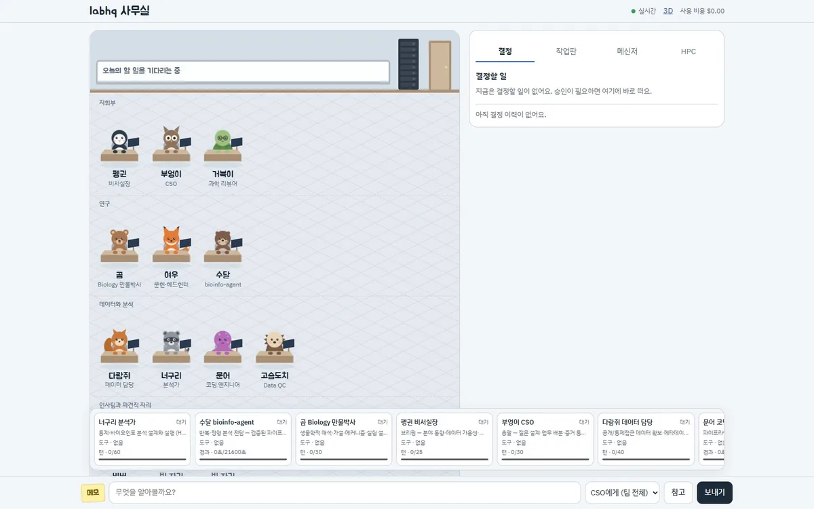
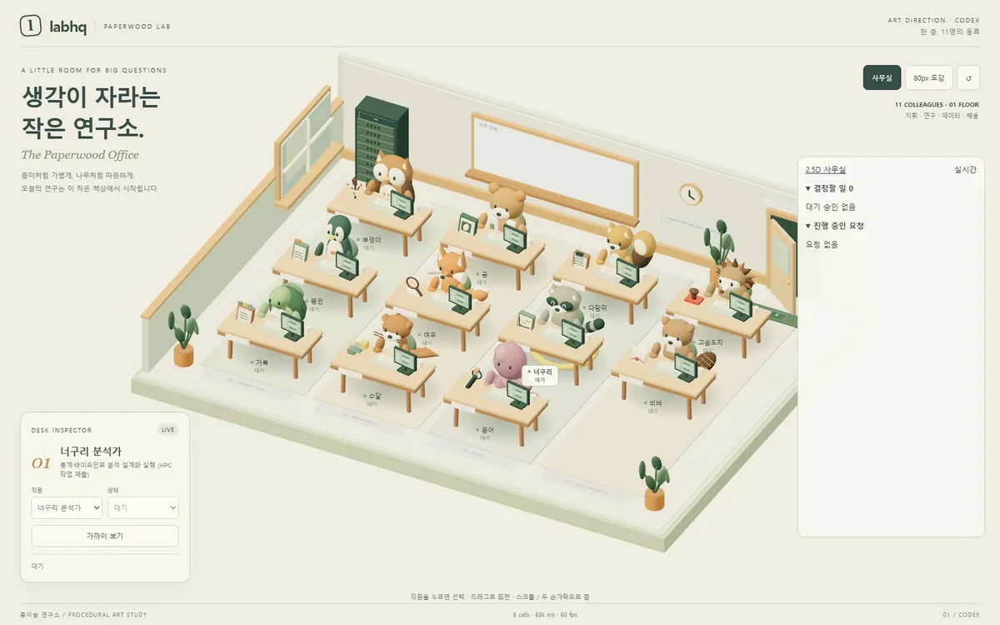
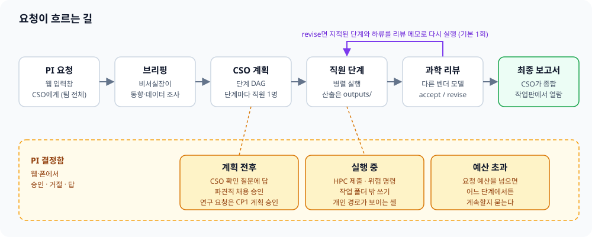
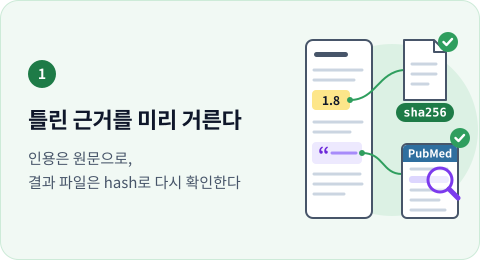
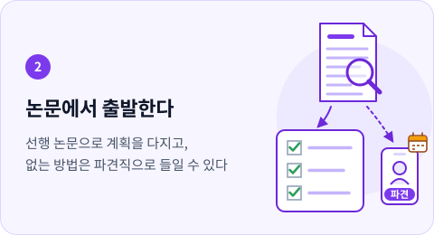
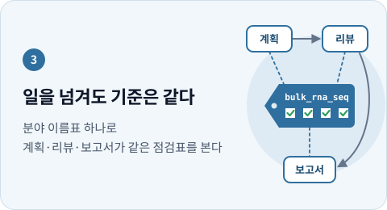
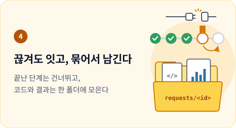
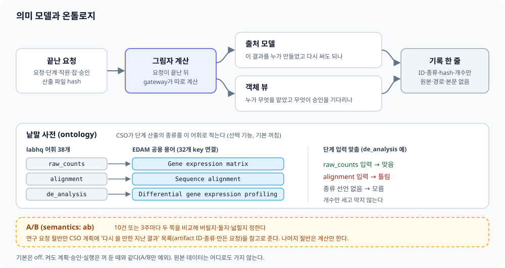

# labhq — 혼자 운영하는 바이오인포 연구소 HQ (v0.25)

<!-- badges:start -->
[](https://code.claude.com/docs/en/overview)
[](https://github.com/openai/codex)
[](docs/manual.md#설정-포인트)
[](docs/manual.md#설정-포인트)
[](docs/manual.md#설정-포인트)
[](docs/manual.md#연결된-도구)
[](https://www.ebi.ac.uk/chembl/)
[](https://clinicaltrials.gov/)
[](https://platform.opentargets.org/)
[](https://pubmed.ncbi.nlm.nih.gov/)
[](https://www.biorxiv.org/)
[](https://github.com/ehojune/bioinfo-agent)
[](https://github.com/jmiao24/Paper2Agent)

[](https://github.com/ehojune/bioinfo-team-3d/actions/workflows/test.yml)
[](https://www.python.org/)
[](LICENSE)
[](LICENSE-CC-BY-SA-4.0.txt)
[](patch_notes/README.md)
<!-- badges:end -->

<p align="center"><b>한국어</b> · <a href="README.en.md">English</a></p>

labhq는 Claude Code와 Codex를 **연구소 직원**처럼 부리는 바이오인포 **멀티 에이전트 오케스트레이션 플랫폼**입니다.
웹 사무실에 요청을 적으면 CSO가 계획을 세우고, 직원들이 나눠 실행하고, 다른 회사 모델이 리뷰한 뒤 보고서가 나옵니다.
위험한 일과 돈이 드는 일은 PI가 웹이나 폰에서 승인합니다.

| 2.5D 사무실 (`/`) | 3D 사무실 (`/3d`) |
|---|---|
|  |  |

mock 데모(`labhq demo --web`)를 15초 동안 녹화한 화면입니다. 요청 하나가 CSO 계획, 승인, 단계 진행을 거쳐 끝납니다.
정지 화면: [2.5D](docs/media/office-25d.png) · [3D](docs/media/office-3d.png)

## 어떻게 일하나



- 직원 11명이 역할마다 다른 엔진·모델·도구를 씁니다. 과학 리뷰어는 일부러 다른 회사 모델입니다.
- 반복·정형 분석은 [bioinfo-agent](https://github.com/ehojune/bioinfo-agent) 직원이 맡습니다. 이 프로젝트의 PI가 만든 Claude Code 에이전트로, 말로 시킨 분석에 맞는 nf-core Nextflow 파이프라인을 골라 시간·디스크를 계산한 계획서를 내고, 승인 뒤 실행해 MultiQC로 QC 판정까지 돌려줍니다.
- 팀에 없는 방법이 필요하면 논문·코드를 [Paper2Agent](https://github.com/jmiao24/Paper2Agent)로 바꿔 **파견직**으로 채용합니다.
- HPC(SGE·PBS·Slurm)에 잡을 내면 직원 세션은 잡이 끝날 때까지 쉬었다가 같은 세션으로 이어 갑니다.
- CSO는 권한·비용·데이터 접근, PI만 아는 선택(질병·코호트), 분석 깊이만 묻습니다. 나머지 설계는 스스로 정하고 계획과 보고서에 **가정**으로 적습니다.
- 단계마다 작업 폴더에 지시문·산출·엔진·비용 기록이 남습니다.

## labhq가 공들인 네 가지

labhq는 빨리 끝내기보다 점검을 겹쳐 두고 근거를 다시 확인할 수 있게 남기는 쪽을 골랐습니다.

<table>
<tr>
<td width="50%" valign="top">



**틀린 근거를 미리 거른다**

AI가 인용을 지어내거나 잘못 읽는 실수(hallucination)를 보고서 전에 잡으려고 검사를 두 겹 둡니다. 과학 리뷰어(GPT-6-Astra)가 PubMed 원문을 열어 인용을 대조하고, 결론을 바꾸는 지적(P1)이 남으면 요청은 통과하지 못합니다. [The Virtual Biotech](https://github.com/harrisongzhang/TheVirtualBiotech)(Science 2026)에서 가져온 claim 장부와 산출 sha256 기록(MIT)으로 `labhq verify`가 보고서 근거 앵커와 hash를 다시 검사합니다.

<details><summary>근거와 한계</summary>

<sub>근거: [11차 시운전](https://github.com/ehojune/bioinfo-team-3d/issues/298#issuecomment-5969847101)(GSE19804): 문헌 단계가 원 논문의 SEMA5A 방향을 거꾸로 적고 Yang 2018 허브 목록을 빠뜨린 것을 리뷰어가 PubMed 원문과 대조해 잡았고, 요청은 보고서를 내기 전에 멈췄습니다 · [예시 GSE10072](docs/examples/gse10072/README.md): `labhq verify`로 산출 58개 hash 재확인 · [#339](https://github.com/ehojune/bioinfo-team-3d/pull/339)(verify)</sub>

<sub>한계: 근거 앵커와 PI 근거 승인(CP2)은 기본 꺼짐인 연구 lane에서만 돕니다. `verify`는 파일이 바뀌지 않았는지만 보며, 내용이 옳다는 증명은 아닙니다. 리뷰가 놓친 비율은 재지 않았습니다.</sub>

</details>

</td>
<td width="50%" valign="top">



**논문에서 출발한다**

계획 전에 선행 연구 직원이 같은 주제의 논문·리뷰 몇 편에서 꼭 할 분석을 뽑아 점검표에 넣고, 보고서에는 인용을 붙인 '선행 연구 기준' 절을 둡니다. 팀에 없는 방법이 필요하면 PI 승인 뒤 [Paper2Agent](https://github.com/jmiao24/Paper2Agent)로 그 논문의 코드를 도구로 쥔 기한부 **파견직**을 들일 수 있습니다.

<details><summary>근거와 한계</summary>

<sub>근거: [#395](https://github.com/ehojune/bioinfo-team-3d/pull/395)(선행 연구 단계) · [매뉴얼: 선행 연구 기준](docs/manual.md#topic-점검표와-선행-연구-기준) · [매뉴얼: 파견직 제도](docs/manual.md#파견직-제도-paper2agent)</sub>

<sub>한계: 선행 연구 단계는 시험 요청 4건에서만 돌았습니다. 파견직은 mock 시험만 통과했고 실제 논문으로 채용까지 간 적이 없으며, Paper2Agent skill은 따로 설치해야 합니다.</sub>

</details>

</td>
</tr>
<tr>
<td width="50%" valign="top">



**일을 넘겨도 기준은 같다**

CSO는 계획마다 분야 이름표(topic 키)를 적습니다. 키는 PI가 검토한 어휘(123키, 그중 79키는 [EDAM](https://github.com/edamontology/edamontology) 온톨로지와 연결)의 topic 43개에서 고릅니다. topic은 논문 63편·교과서 4권·웹 자료 66건을 조사해 넓혔습니다([#420](https://github.com/ehojune/bioinfo-team-3d/issues/420)). 코드는 그 키로 점검표를 골라 계획·리뷰·단독 처리에 같은 목록을 넘기고, 가정으로 답한 항목은 보고서 '한계'에 남깁니다. 연구 lane(기본 꺼짐)의 분야 규칙 pack도 같은 키로 붙습니다.

<details><summary>근거와 한계</summary>

<sub>근거: [#390](https://github.com/ehojune/bioinfo-team-3d/pull/390)(topic 필수, 어휘 100키) · [#369](https://github.com/ehojune/bioinfo-team-3d/issues/369)(계획 문장 한 줄로 분야 규칙이 빠지던 우회 → topic 판정으로 닫음)</sub>

<sub>한계: 점검표는 20개 분야, 60항목입니다([#402](https://github.com/ehojune/bioinfo-team-3d/pull/402)). #420으로 더한 23개 분야는 아직 점검표가 없습니다. 새로 넣은 17개 분야는 실제 요청에서 돌지 않았습니다. 누락이 줄었는지는 재지 않았습니다. 이름표 사이 관계를 쓰는 의미 모델은 기본 꺼짐인 [그림자 단계](#어노테이션시맨틱온톨로지)이고, 단순 SQL 기준선보다 낫다는 결과는 없습니다.</sub>

</details>

</td>
<td width="50%" valign="top">



**끊겨도 잇고, 묶어서 남긴다**

요청·단계·승인을 SQLite에 저장합니다. PC가 멈춰도 PI 재개 카드 한 장이면 끝난 단계는 건너뛰고 멈춘 단계부터 잇고, 구독 한도·로그인 만료에는 요청을 세워 두었다가 풀리면 다시 갑니다. 요청이 끝나면 hash로 확인한 산출과 분석 코드를 한 폴더([요청 묶음](docs/manual.md#요청-묶음))에 모으고, 단계 사이 경로는 상대경로로 바꿉니다.

<details><summary>근거와 한계</summary>

<sub>근거: [v0.25 리허설](docs/status/2026-10-04-0458-release-v025.md) 요청 2: PC가 멈춰 labhq가 모두 꺼진 뒤 이어 가기 카드 한 장으로 다시 이어서 리뷰 통과(accept)까지 갔습니다 · [벤치 A 2차](https://github.com/ehojune/bioinfo-team-3d/issues/373#issuecomment-5975156477): labhq 재현성 2 → 4점([#384](https://github.com/ehojune/bioinfo-team-3d/pull/384)), Astra 단독은 같은 보고서가 두 채점에서 4점·3점 · [#389](https://github.com/ehojune/bioinfo-team-3d/pull/389)(요청 묶음)</sub>

<sub>한계: 한도·로그인 대기는 10-05 실제 로그인 만료로 요청 4건이 실패한 뒤 고쳤고, test로만 확인했습니다. 재로그인은 사람이 합니다. 요청 묶음은 같은 PC runner의 산출만 모으며, 넣은 뒤 재현성은 다시 채점하지 않았습니다.</sub>

</details>

</td>
</tr>
</table>

## 단독 AI 세션·연구 workbench와 비교

| | labhq | Claude Code·Codex 단독 | 연구 workbench |
|---|---|---|---|
| 리뷰 | ✅ 다른 회사 리뷰어\* | ❌ 같은 모델 자기 검토 | ⚠️ 켜면 별도 맥락 검토 |
| 분석 기준 | ✅ 선행 논문·분야 점검표 | ⚠️ 모델 재량 | ⚠️ 고른 skill 따라 |
| 근거 추적 | ✅ 산출 hash·앵커 재검사 | ⚠️ 남긴 스크립트·로그 | ✅ 산출 출처·재실행 비교 |
| 승인 | ✅ 웹·폰 카드 | ⚠️ 세션 안에서 | ✅ 승인 모드·폰 원격 |
| 중단 뒤 | ✅ 멈춘 단계부터 | ⚠️ 세션만 재개 | ✅ 원격 잡 복구 |
| 문헌 관리 | ⚠️ 검색·인용만 | ⚠️ 붙인 도구 따라 | ✅ 서재·PDF·선별 |
| 속도·비용 | ❌ 큰 과제 144분·$31 | ✅ 같은 과제 19분 | — |

연구 workbench 칸은 [open-science](https://github.com/aipoch/open-science) v0.35.0 README·ROADMAP을 읽고 적었고, 앱은 돌려 보지 않았습니다(2026-10, [#316](https://github.com/ehojune/bioinfo-team-3d/issues/316)). 속도·비용은 재지 않아 —로 둡니다. labhq 점검표가 누락을 줄이는지는 아직 재지 않았습니다.
\* Claude 직원 8명의 산출 기준입니다. 문헌 담당을 포함한 Codex 직원 3명의 산출은 같은 회사(OpenAI) 리뷰어가 봅니다.
단독 칸의 속도·근거 추적은 벤치 기준선(GPT-6-Astra 단독)에서 잰 값입니다. 채점은 GPT-6.1-Sol이 출처를 가리고 과제마다 한 번 했습니다([#373](https://github.com/ehojune/bioinfo-team-3d/issues/373)).

**labhq가 맞는 경우**: 결과를 근거째 남에게 넘겨야 하거나, 몇 시간짜리 분석을 맡겨 두고 결정만 폰으로 하고 싶을 때. v0.25 리허설에서 accept된 4건은 설치·예산·이어 가기를 뺀 PI 카드가 요청당 0~1장이었습니다([리허설](docs/status/2026-10-04-0458-release-v025.md)).

**아직 지는 곳**: 같은 과제를 눈가림 채점하면 정확성은 같았지만 총점은 단독 세션이 앞섰습니다(10-05 벤치 C: 큰 과제 22 대 28, 작은 과제 20:24·22:23·20:23). 진 곳은 재현 자료가 덜 갖춰진 점과 보고서가 긴 점입니다(큰 과제 본문 약 12,600자 대 3,100자)([#373](https://github.com/ehojune/bioinfo-team-3d/issues/373), [#423](https://github.com/ehojune/bioinfo-team-3d/issues/423)). 작은 요청은 [#388](https://github.com/ehojune/bioinfo-team-3d/pull/388)부터 강한 모델 한 명이 바로 끝내고, 이 경로를 탄 과제는 격차가 줄었습니다(2→1점, 6→3점). 이때는 기본으로 리뷰를 거치지 않습니다. 문헌 서재·PDF 관리가 중심이면 workbench가 맞습니다.

## 예시: 공개 폐선암 데이터 분석

> GEO 공개 폐선암 데이터 GSE10072를 내려받아 종양 대 정상 차등발현, GSEA, STRING 허브, 군집을 분석해 줘. 같은 환자 짝이 있으면 그 구조를 반영해 줘.

- 1시간 17분, 12단계. PI는 카드 세 장(설치 확인, 계획 승인, 근거 승인)에 답했습니다.
- 짝 33쌍을 반영한 모형으로 DE 유전자 554개를 찾았고, 종양에서 세포 증식 경로가 높았습니다. 원 논문의 표지 유전자도 재현됐습니다.
- 보고서의 수치마다 근거 표시가 달려 있고, 다른 회사 모델의 과학 리뷰를 통과했습니다.

[요청 원문, 카드, 그림, 보고서 보기](docs/examples/gse10072/README.md)

## 어노테이션·시맨틱·온톨로지



기록에 뜻을 붙이는 층은 셋입니다. 아래 층일수록 단단하고, 위로 갈수록 가볍게 둡니다.

| 층 | 무엇인가 | labhq에서 |
|---|---|---|
| 어노테이션 | 데이터와 근거에 붙는 이름표 | 어휘 100개(PI 검토, 68개 key를 생물정보학 공용 사전 [EDAM](https://github.com/edamontology/edamontology) 용어와 연결), 근거의 종류·출처 수준, 산출 파일 sha256 |
| 시맨틱 | 이름표로 무엇을 판정할지 정한 약속 | PI가 승인한 계획의 hash 동결(CP1), 분석 종류별 규칙 pack(단일세포 DE, 벌크 종양-정상; 요청의 topic 키로 적용), 단계 입력이 방법에 맞는지 맞음·틀림·모름 판정, 보고서 근거 앵커 |
| 온톨로지 | 이름표 사이의 관계 | 상하위 관계 몇 개만 둡니다. 끝난 요청을 출처 모델("누가 만들었고 다시 써도 되나")과 객체 뷰("누가 무엇을 맡았고 무엇이 승인을 기다리나")로 묶는 지도는 그림자로만 계산합니다 |

그림자 계산은 기본 꺼짐이고 켜도 기록만 합니다. `semantics: ab`는 연구 요청 절반에만 재사용 후보를 CSO 계획에 참고로 줘서 효과를 견줍니다. 어휘는 생명정보 요청 전반으로 넓히는 중입니다(#375). 자세한 설명은 [매뉴얼](docs/manual.md#의미-모델과-온톨로지)에 있습니다.

## 웹으로 시작하기

### 1. 먼저 둘러보기 (API 키·클러스터 없이)

```bash
git clone https://github.com/ehojune/bioinfo-team-3d.git
cd bioinfo-team-3d
pip install -e ".[dev]"
labhq demo --web
```

출력된 `http://127.0.0.1:8787/?token=…`을 열면 mock 팀이 일하는 사무실이 뜹니다. 폰으로 보려면 PC와 폰을 같은 Wi-Fi에 두고 `labhq demo --web --phone`을 실행한 뒤 출력된 `/3d` URL을 엽니다.

### 2. 설치와 설정

필요한 것: Python 3.10 이상, Git, 직원으로 쓸 CLI(Claude Code·Codex)의 설치와 로그인. npm으로 설치한 CLI는 Node.js도 필요합니다.

```bash
labhq init                                   # 설정 파일과 gateway token을 만들고 점검
export LABHQ_CONFIG=$PWD/config/labhq.yaml   # PowerShell: $env:LABHQ_CONFIG = "$PWD\config\labhq.yaml"
labhq doctor                                 # 설정·엔진·직원·계산 도구 점검
```

`labhq init`은 HPC와 bioinfo-agent 경로를 묻습니다. 직원 전용 로그인 폴더가 필요하면 사람이 칠 로그인 명령도 알려 줍니다.

### 3. 띄우기

터미널 두 개에서 실행합니다. 2단계의 `export`는 그 터미널에만 걸리므로 새 터미널에서도 `LABHQ_CONFIG`를 다시 지정합니다(또는 `labhq --config config/labhq.yaml runner`처럼 명령 앞에 붙입니다). 빠뜨리면 그쪽이 기본 token으로 떠서 gateway와 runner가 서로 붙지 못합니다.

```bash
labhq gateway   # 요청·승인·이벤트를 저장하고 웹 사무실을 연다
labhq runner    # 직원 CLI를 실제로 돌린다. gateway로 나가는 연결만 쓴다
```

세 번째 터미널에서 `labhq open`을 실행하면 웹 사무실이 로그인된 채 열립니다(토큰은 화면에 찍지 않습니다). 직접 열려면 `http://127.0.0.1:8787/?token=<client_token>`을 엽니다. `client_token`은 설정 파일의 `gateway.client_token` 값이고, 한 번 열면 그 기기에 저장됩니다.

### 4. 첫 요청

1. 아래 입력창에 요청을 적습니다. 처음엔 작은 공개 데이터 요청이 좋습니다(예: "공개 펭귄 데이터 QC 요약").
2. CSO가 확인 질문을 하면 선택지를 고르고 **답하고 진행**을 누릅니다.
3. 승인할 일은 오른쪽 **결정** 탭(결정할 일)에 카드로 옵니다. 승인하거나 거절하면 이어 갑니다.
4. **작업판**에서 단계 진행과 산출을 보고, 끝나면 **최종 보고서**를 펼칩니다. 보고서를 두고 더 물을 땐 **이어 묻기**를 씁니다.
5. CSO가 맡은 실행 중 요청을 고르면 입력창 기본값은 **이 요청에 메모**입니다. 메모는 이미 도는 turn이 아니라 다음 계획·단계부터 전달됩니다. 한 직원에게 바로 맡긴 요청은 끝난 뒤 **이어 묻기**를 씁니다.

한 직원에게 바로 맡기려면 입력창에서 그 직원을 고르거나 노란 메모를 책상에 끌어다 놓습니다.
GitHub URL·DOI·데이터 경로는 **참고** 버튼으로 붙입니다.
폰 연결은 매뉴얼의 [띄우기와 접속](docs/manual.md#띄우기와-접속)(Tailscale)과 [웹 사무실](docs/manual.md#웹-사무실)(홈 화면에 추가)에 있습니다.

## 안전하게 쓰려면

- HPC 제출, 위험한 셸 명령, 작업 폴더 밖 쓰기, 예산 초과, 파견직 채용은 PI가 정합니다.
- 통제(DUA) 데이터 원본은 파일 도구로 열지 않고 HPC 잡 안에서만 다룹니다.
- 직원은 PI 계정으로 돌지만 `~/.ssh`·브라우저 프로필 같은 개인 경로는 가립니다. 이 차단은 Claude 직원에게 걸리고, Codex 직원(기본 11명 중 3명)은 지침만 받습니다. 경로 가드는 sandbox가 아니어서 작정한 직원까지 막지는 못합니다.

자세한 기준은 [안전 장치](docs/manual.md#안전-장치)에 있습니다.

## 로드맵

| 버전 | 목표 |
|---|---|
| v0.25 | PI가 공개 데이터로 labhq를 시험한다 — **2026-10-04 선언** |
| v0.5 | PI가 자기 공개 데이터로 로컬에서 연구한다 |
| v0.75 | PI가 HPC에서 공개 데이터로 연구한다 |
| v0.9 | PI가 통제 데이터로 연구한다(HPC 위) |
| v0.95 | 다른 연구자가 문서만 보고 설치해 공개 데이터로 한 건을 끝낸다 |
| v1 | 다른 연구자가 자기 통제 데이터로 연구 문제를 두 개까지 푼다 |
| v1.25 | 연구를 넘어 논문을 쓴다 |

버전마다 통과 기준이 있고, 채우면 다음 버전으로 넘어갑니다. 기준과 지금 상태, 남은 일은 [매뉴얼의 로드맵](docs/manual.md#로드맵)에 있습니다.

## 더 읽기

| 문서 | 읽는 사람 |
|---|---|
| [매뉴얼](docs/manual.md) | 명령줄, 설정, 안전 장치, 연구 lane, 알려진 한계까지 깊이 보려는 사람 |
| [PI Q&A](docs/pi-qa.md) | PI가 물은 것과 답, 내린 결정 |
| [연구 수행 규약](docs/research_protocol.md) | 연구 lane의 계약과 checkpoint |
| [패치노트](patch_notes/README.md) | 바뀐 내용 |
| [AGENTS.md](AGENTS.md) · [HANDOFF.md](HANDOFF.md) | 이 저장소를 개발하는 에이전트 |

코드는 [GPL-3.0-or-later](LICENSE), 문서·그림·데이터 표는 [CC BY-SA 4.0](LICENSE-CC-BY-SA-4.0.txt)입니다. 예외는 [매뉴얼의 라이선스](docs/manual.md#라이선스)에 있습니다.
