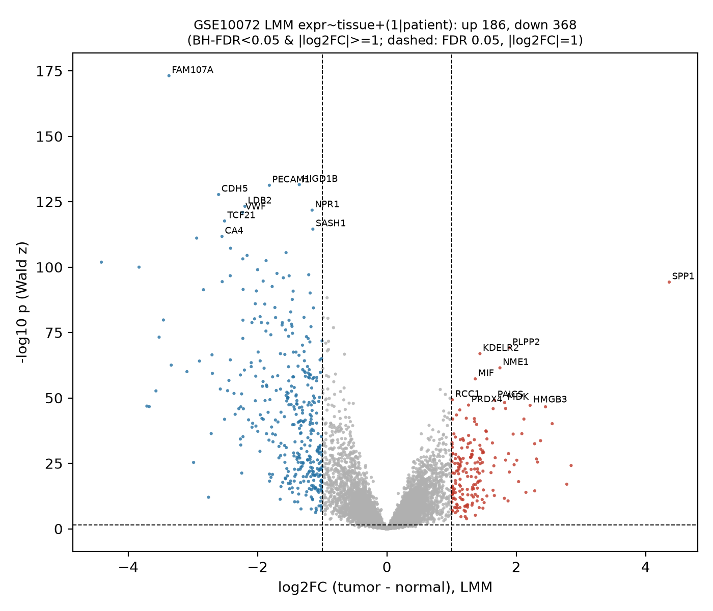
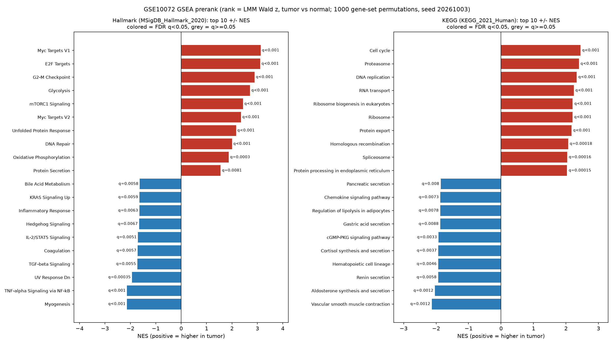
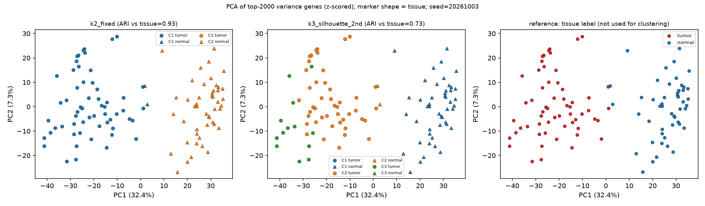

# 예시: 공개 폐선암 데이터 분석 (GEO GSE10072)

labhq 모의 시운전 10차(2026-10-03)의 실제 기록입니다. PI는 아래 요청 한 번을 보냈고, 카드 세 장에 답했습니다.

## 보낸 요청

> GEO 공개 폐선암(lung adenocarcinoma) 데이터 GSE10072(폐선암 대 정상 폐조직, Affymetrix HG-U133A)를 내려받아 이 PC에서 분석해 줘. 1) 데이터 확인과 정규화 상태 점검 2) 종양 대 정상 차등발현(DE, 다중검정 보정) 3) GSEA(Hallmark 또는 KEGG) 4) DE 상위 유전자로 STRING 상호작용 네트워크와 허브 유전자 5) 발현 기반 k-means 군집과 군집별 특징 6) pathway 농축 분석. 같은 환자에서 나온 종양·정상 짝이 있는지 먼저 확인하고, 있으면 그 구조를 반영한 모형(쌍체 또는 혼합모형)을 주 분석으로 해 줘. 결과 표와 그림, 해석 보고서를 남겨 줘. 이 PC에는 R이 없고 Python 3.12만 있다. 패키지 설치가 필요하면 먼저 물어봐.

## PI가 답한 카드

| 카드 | 물은 것 | 답 |
|---|---|---|
| 확인 질문 | 패키지 다섯 개 설치, GEO·gene set·STRING 접속 | 모두 승인 |
| CP1 계획 승인 | 12단계 계획과 사전 규칙(짝이 10쌍 이상이면 혼합모형) | 승인 |
| CP2 근거 승인 | claim 17개, 근거 60행(거부 0) | 승인 |

## 무엇이 나왔나

- **1시간 17분, 12단계.** CSO가 계획을 세우고, 직원 다섯(엔지니어, 분석가, 데이터 관리자, QC 검토자, 생물학자)이 나눠 실행했습니다. QC 단계가 세 번 결과를 다시 계산해 확인했고, 마지막에 다른 회사 모델(Codex)이 과학 리뷰를 해 accept했습니다.
- **짝을 반영한 분석.** 환자 74명 중 33명이 종양·정상 짝이어서 혼합모형으로 분석했습니다. DE 유전자는 554개(종양에서 상향 186, 하향 368)였습니다.
- **알려진 생물학과 맞음.** 종양에서는 세포 증식 경로(E2F, G2-M, MYC)가, 정상에서는 폐포·혈관 유전자가 높았습니다. 원 논문의 표지 유전자(NEK2, TTK, PRC1)도 종양 상향으로 재현됐습니다.

보고서의 수치 문장마다 근거 표시가 달려 있고, `labhq verify`로 산출 파일 58개의 hash를 다시 확인했습니다.

| 차등발현 | 경로(GSEA) | 군집 |
|---|---|---|
|  |  |  |

**[최종 보고서 원문 보기](report.md)**
